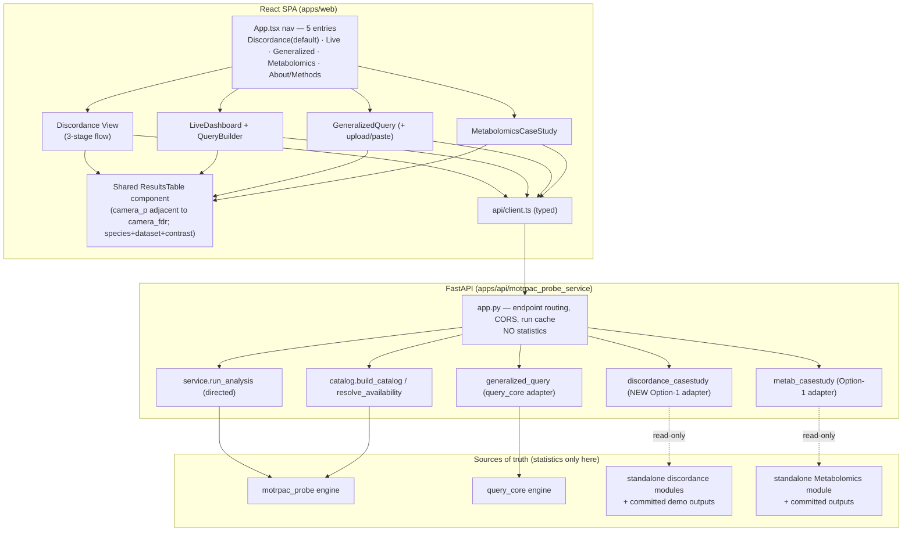
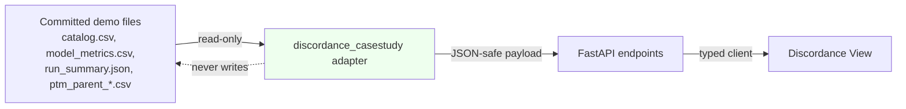
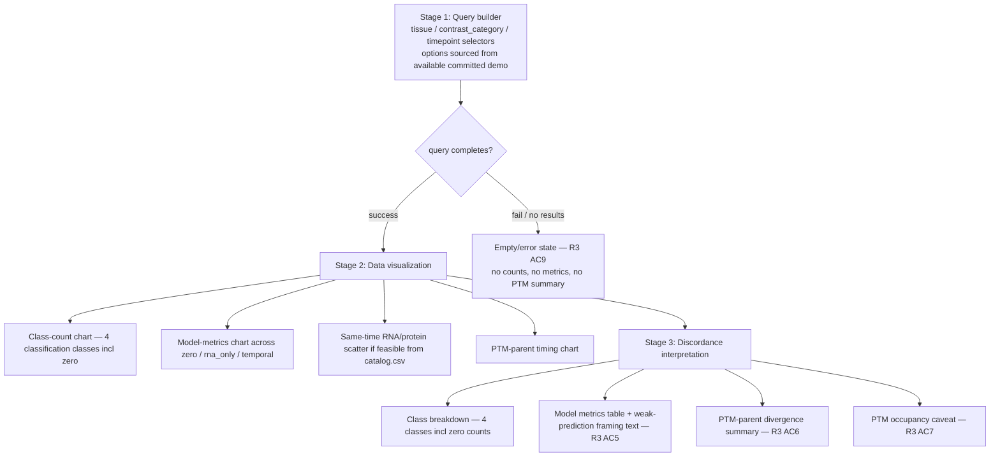

# Design Document: Finalize Discordance MVP

## Overview

This feature finalizes the Track 2 "Omic Discordance Explained" MVP by surfacing deliverables that already exist in the repository as CLI-only pilots. The Track 2 goal is to compare compatible omic layers (RNA, total protein, PTM) within a defined tissue, produce a catalog of concordant/discordant events, and produce a predictive model of discordance — all framed honestly (a result, not a success claim), keeping cohorts separate and preserving the PTM occupancy caveat.

The design is deliberately **additive and read-only** with respect to the statistical engines. The standalone discordance modules under `MoTrPAC Hackathon/generalized/discordance/` (and their committed demo outputs), the `motrpac_probe` engine, and `query_core` remain the single source of truth. No statistics are computed in the FastAPI layer or the React client. Everything new either (a) documents existing behavior, (b) serves committed module outputs through an Option-1 read-only adapter, (c) rewires the UI to the live API, or (d) hardens reproducibility and verification.

The centerpiece is a new **Discordance main view** organized as a three-stage flow — query builder → data visualization → discordance interpretation — backed by three new read-only endpoints (`/api/discordance/catalog`, `/api/discordance/model`, `/api/discordance/ptm-parent`). These mirror the metabolomics Option-1 adapter (`metab_casestudy.py`) exactly: guarded by an `available()` check, serving committed CSV/JSON, JSON-safe, no statistics.

### Guiding principles (from the engine's own docstrings and requirements)

- **Source-of-truth boundary (R11):** the API and React only serve, shape (JSON-safe), and render. All statistics originate in the engines/standalone modules.
- **Species-derived study selection (R11):** rat → chronic study, human → acute study; no acute/chronic input control.
- **Honest framing and multiplicity discipline (R12):** the frozen 52-column BH family; the headline male rat SKM-GN protein 8-week result is `q = 0.0584` and labeled not significant; the 16-column `q = 0.0413` is a labeled sensitivity analysis only.
- **Traceability discipline (R13):** each feature gets an ADR in `DECISIONS.md`, a `VERIFICATION.md` checkpoint, and rows in `REQUIREMENTS_TRACEABILITY.md`; nothing is claimed before the relevant test/command is run.

### V1 scope boundaries (intentional limitations)

- The discordance adapter serves **committed demo outputs** only. Live recompute of the discordance catalog from arbitrary tissue/contrast/timepoint is a documented follow-on, **not in this MVP**. The v1 query builder therefore presents the **available committed demo(s)** as the selectable options rather than triggering a recompute.
- The current committed demo is a single **muscle EE-CON `post_24_hr`** run (`demo_muscle_ee`) plus the PTM-parent audit (`demo_ptm_parent_ee`). Additional committed demos (`demo_muscle_re_24h`, `demo_transfer_ee_to_re_24h`) may be surfaced as additional selectable options if their output files are present, guarded by the same `available()` discipline.
- The discordance endpoints are **GET-only** and never recompute; a missing/malformed committed file yields an unavailable (`404`) response, never fabricated or partial data.

---

## Architecture

### System context

The application is a two-tier system: a React SPA (`apps/web`) talking over HTTP/JSON to a FastAPI service (`apps/api/motrpac_probe_service`), which in turn calls in-process into three statistical sources of truth. This feature adds a fourth adapter (discordance) that mirrors the metabolomics Option-1 pattern.



### The Option-1 adapter pattern (the shape every read-only adapter follows)

`metab_casestudy.py` and `generalized_query.py` establish the pattern the new discordance adapter mirrors:

1. Resolve the repository root as `_REPO = Path(__file__).resolve().parents[3]` (path-coupling constraint documented under R8).
2. Point at the module directory under `MoTrPAC Hackathon/...`.
3. Expose `available()` that returns `True` only when every required committed output file exists.
4. Read committed CSV/JSON, coerce every value to a JSON-safe scalar (`NaN`/`Infinity` → `None`), and return a JSON-safe dataclass.
5. Compute **no statistics** in the adapter; the module is the source of truth.
6. The endpoint returns `404` when `not available()`.

### Read/compute boundary



The adapter never mutates the committed files. Repeated GETs are idempotent and byte-stable because the payload is a pure function of the committed file bytes.

---

## Components and Interfaces

### Backend components

#### 1. `discordance_casestudy.py` (NEW adapter — R2)

Mirrors `metab_casestudy.py`. Location: `apps/api/motrpac_probe_service/discordance_casestudy.py`.

```python
_REPO = Path(__file__).resolve().parents[3]
DISCORDANCE_DIR = _REPO / "MoTrPAC Hackathon" / "generalized" / "discordance"
DEMO_DIR = DISCORDANCE_DIR / "demo_muscle_ee"
PTM_DIR = DISCORDANCE_DIR / "demo_ptm_parent_ee"

CATALOG_CSV        = DEMO_DIR / "catalog.csv"
MODEL_METRICS_CSV  = DEMO_DIR / "model_metrics.csv"
MODEL_PREDS_CSV    = DEMO_DIR / "model_predictions.csv"
RUN_SUMMARY_JSON   = DEMO_DIR / "run_summary.json"
PTM_SUMMARY_CSV    = PTM_DIR / "ptm_parent_summary.csv"
PTM_CANDIDATES_CSV = PTM_DIR / "ptm_parent_candidates.csv"

# The KNOWN event_class domain: 4 classification classes + 2 coverage states (see Data Models).
CLASSIFICATION_CLASSES = (
    "supported_concordant", "supported_opposite",
    "rna_response_protein_equivalent", "indeterminate",
)
COVERAGE_STATES = ("no_protein_measurement", "no_rna_measurement")
KNOWN_EVENT_CLASSES = frozenset(CLASSIFICATION_CLASSES + COVERAGE_STATES)
```

Public functions:

| Function | Purpose | Guard |
| --- | --- | --- |
| `catalog_available() -> bool` | catalog.csv + run_summary.json exist AND every `event_class` in the known set | R2 AC3, AC6, AC8 |
| `model_available() -> bool` | model_metrics.csv + run_summary.json exist | R2 AC3 |
| `ptm_available() -> bool` | ptm_parent_summary.csv exists | R2 AC3 |
| `build_catalog_summary() -> DiscordanceCatalogResponse` | per-class counts + coverage-state counts + provenance, read from files | R2 AC1, AC2, AC4, AC6 |
| `build_model() -> DiscordanceModelResponse` | 6 model_metrics rows + run_summary model block + limitations | R2 AC1, AC2, AC4 |
| `build_ptm_parent() -> PtmParentResponse` | ptm_parent_summary rows + candidate count + occupancy caveat | R2 AC1, AC2, AC4 |

`catalog_available()` incorporates the event-class domain check (R2 AC8): it opens `catalog.csv`, and if any row's `event_class` is missing, empty, or not in `KNOWN_EVENT_CLASSES`, it returns `False` so the endpoint reports the catalog unavailable rather than returning it. This is the one place the adapter reads the full catalog for validation; it still computes no statistics — it validates a domain and counts by class exactly as the values appear.

JSON-safety uses the same `_num`/`_clean` helper as `metab_casestudy._num` (`NaN`/`inf` → `None`).

#### 2. New endpoints in `app.py` (R2)

Following the metabolomics pattern (`404` when `not available()`):

| Method + path | Handler | Returns | Unavailable |
| --- | --- | --- | --- |
| `GET /api/discordance/catalog` | `discordance_casestudy.build_catalog_summary()` | class counts + coverage-state counts + run settings + provenance | `404` if `not catalog_available()` |
| `GET /api/discordance/model` | `discordance_casestudy.build_model()` | 6 metric rows + model block + limitations | `404` if `not model_available()` |
| `GET /api/discordance/ptm-parent` | `discordance_casestudy.build_ptm_parent()` | PTM-parent summary rows + candidate count + caveat | `404` if `not ptm_available()` |

All three are `GET`; the adapter honors no write/create/update/delete (R2 AC1). No `_RUNS` cache entry is created; the response is a pure function of committed bytes.

#### 3. New generalized upload endpoint in `app.py` + `generalized_query.py` (R5)

Add `run_uploaded(signature_csv_text: str, tissue: str, reference_contrast_category: str, reference: str = "default")` to `generalized_query.py`, mirroring `run_bundled` but taking a **client-supplied signature** written to a **content-addressed temp file** (like `service._materialize_signature`):

```python
def run_uploaded(signature_csv_text: str, *, tissue: str,
                 reference_contrast_category: str, reference: str = "default") -> dict:
    if not available():
        raise FileNotFoundError("generalized query_core module not present")
    ok, which = _validate_query_core_schema(signature_csv_text)   # returns (bool, failing-requirement)
    if not ok:
        raise SchemaError(which)   # -> 422 identifying the unmet schema requirement (R5 AC2)
    raw = signature_csv_text.encode("utf-8")
    digest = hashlib.sha256(raw).hexdigest()
    tmp = Path(tempfile.gettempdir()) / f"genq_sig_{digest[:16]}.csv"
    tmp.write_bytes(raw)
    try:
        with tempfile.TemporaryDirectory() as out_root:
            out = Path(out_root) / "q"
            summary = _run_query(disease_path=tmp, reference_path=<resolved>, out_dir=out,
                                 tissue=tissue, reference_contrast_category=reference_contrast_category)
            ...  # normalize identically to run_bundled
    finally:
        tmp.unlink(missing_ok=True)
```

New endpoint `POST /api/generalized/query` accepts `{ signature_csv_text, tissue, reference_contrast_category, reference }`, returns the same normalized shape as `run_bundled` on success, and `422` with the failing schema requirement on non-conforming input (R5 AC1, AC2). The schema validation reuses `query_core`'s own column expectations so the check stays aligned with the engine.

#### 4. `catalog.py` change — add discordance to `ANALYSIS_TYPES` (R2, R11)

Add a `discordance_catalog` entry to the `ANALYSIS_TYPES` dict and a discordance-relevant capability note, so the catalog advertises the analysis type consistently with the others:

```python
"discordance_catalog": {
    "label": "Discordance catalog + predictive model",
    "cohort": "MoTrPAC muscle EE-CON: RNA vs total protein vs PTM within tissue (committed demo)",
    "engine": "standalone MoTrPAC Hackathon/generalized/discordance module (read-only adapter)",
    "api": True, "react": True,
    "note": "Serves committed demo outputs; live recompute is a documented follow-on, not in this MVP.",
},
```

This is additive; no existing catalog behavior changes.

### Frontend components

#### 5. `client.ts` additions (R2, R5)

Add typed methods and response interfaces:

```typescript
export interface DiscordanceCatalogResponse {
  analysis_type: "discordance_catalog";
  schema_version: string;
  tissue: string; contrast_category: string; timepoint: string;
  classification_counts: {           // the four classification classes; zero-safe
    supported_concordant: number; supported_opposite: number;
    rna_response_protein_equivalent: number; indeterminate: number;
  };
  coverage_counts: { no_protein_measurement: number; no_rna_measurement: number };
  total_rows: number;
  settings: Record<string, unknown>;   // alpha, min_effect, equivalence_margin, target_time, earlier_times
  provenance: Record<string, unknown>;
}

export interface DiscordanceModelResponse {
  analysis_type: "discordance_model";
  metrics: Array<{ subset: "all_mapped" | "rna_responsive";
                   model: "zero" | "rna_only" | "temporal";
                   n_rows: number; n_genes: number;
                   mae: number | null; rmse: number | null; r2: number | null }>;
  model_block: Record<string, unknown>;   // eligible_rows/genes, temporal_features, status
  limitations: string[];
  weak_prediction_note: string;
  provenance: Record<string, unknown>;
}

export interface PtmParentResponse {
  analysis_type: "ptm_parent_audit";
  summary_rows: Array<Record<string, number | string | null>>;  // one per timepoint
  candidate_count: number;
  occupancy_caveat: string;
  provenance: Record<string, unknown>;
}

// added to `api`:
//   discordanceCatalog: () => getJSON<DiscordanceCatalogResponse>("/discordance/catalog"),
//   discordanceModel: () => getJSON<DiscordanceModelResponse>("/discordance/model"),
//   discordancePtmParent: () => getJSON<PtmParentResponse>("/discordance/ptm-parent"),
//   generalizedQueryUpload: (body) => postJSON<GeneralizedQueryResult>("/generalized/query", body),
```

#### 6. `Discordance` main view (NEW — R3)

`apps/web/src/components/Discordance.tsx`, three stages rendered in order:



- Stage 1 fetches `discordanceCatalog()`. Because v1 serves committed demos, the selectors present the available committed demo(s) as the selectable option(s); recompute is out of scope and this is stated in the UI.
- Stage 2 renders the class-count chart (from `classification_counts`), the model-metrics comparison chart (from `model.metrics`), an optional same-time RNA/protein scatter (from the catalog rows where both `rna_log2_fc` and `protein_log2_fc` are present — feasibility gated on delivering catalog rows; if not delivered, this chart is omitted, not faked), and PTM-parent timing (from `ptm.summary_rows`).
- Stage 3 renders the class breakdown for the four classification classes including zero counts, the model-metrics table with the visible weak-prediction statement, the PTM-parent divergence summary, and the PTM occupancy caveat as visible text.
- On failure/empty (R3 AC9), the view shows an error/empty-state and renders **none** of the counts, metrics, or PTM summary.

#### 7. `LiveDashboard.tsx` rewire + layer_discordance rendering (R3 AC8, R4, R5)

- Replace the hardcoded request (`example_name="pah_muscle_malenfant2015"`, `target_species="rat"`, `fdr_threshold=0.05`) with a live query builder wired through `QueryBuilder.tsx`.
- Render `layer_discordance` (already returned by the API, previously shown in no view) as a table/section (R3 AC8).
- Add `camera_p` adjacent to `camera_fdr` plus `species` and `dataset` columns to the set-level table via the shared ResultsTable (R5 AC5, AC6).

#### 8. `QueryBuilder.tsx` rewire to live API (R4)

Rewire from the in-memory catalog (`domain/analysis.ts`) to `/api/catalog` + live comparison endpoints, reusing the domain logic that stays valid (`getStudyContext`, `reconcileQueryForSpecies`, `getVisualizationModeFromReturnedLayers`, `layerCapabilities`). Behavior:

- Signature source is exactly one of: built-in example, pasted text, or uploaded CSV (R4 AC1). Example/paste → `signature_rows`; upload → `signature_csv_text` (R4 AC2, AC3).
- Invalid upload (empty, too large, unparseable) is rejected, prior source retained, error shown (R4 AC4).
- Target selectors (species, omics, tissue, sex, timepoint) sourced from `/api/catalog` (R4 AC5). Total catalog failure disables all selectors with an error (R4 AC6); partial degradation disables only the empty dimension(s) (R4 AC7).
- FDR threshold constrained to `0 < t <= 1` (R4 AC8); it is an analysis parameter recorded in the run_id (R4 AC13); include-nonsignificant is presentation-only and never in the run_id (R4 AC14) — both already enforced by `service._run_id`.
- Mandatory mapping-preview gate: call `/api/mappings/preview` and block `/api/comparisons` until the user confirms (R4 AC10). Preview failure blocks the comparison, retains selections, shows an error (R4 AC11). Terms mapping to multiple candidates are surfaced for confirmation, never auto-selected (R4 AC12) — the API already sets `requires_confirmation` and returns per-row `ambiguous`/`candidates`.

#### 9. `GeneralizedQuery.tsx` upload/paste controls (R5)

Add an upload control and a paste control alongside the existing bundled-signature picklist (R5 AC3). Submit via `generalizedQueryUpload()`. A pasted signature that cannot be parsed is rejected with a parse-failure indication **without clearing the pasted text** (R5 AC4).

#### 10. Shared `ResultsTable` component/pattern (R5, R11, R12)

A single reusable results-table pattern used across Live, Generalized, Discordance, and Metabolomics:

- `camera_p` (raw nominal p) rendered in a column **immediately adjacent** to `camera_fdr` (BH q), each with a visible header label: BH q = adjusted over the frozen 52-column multiplicity family; raw p = nominal/unadjusted (R5 AC5).
- Distinctly labeled `species` and `dataset` columns (R5 AC6).
- Every rendered result value carries species + dataset + contrast; the component never renders a bare value lacking those (R5 AC7, AC8, R11.5) — enforced as a component invariant (a row model type that requires those fields).
- Cross-species results display the ortholog-link relation (R5 AC9).
- Headline invariant: where a headline is surfaced, it is the `q = 0.0584` not-significant result; the 16-column `q = 0.0413` is only ever a labeled sensitivity analysis (R12).

#### 11. `App.tsx` navigation consolidation (R6)

- Remove views `architecture(01)`, `technical(02)`, `workflow(03)`, `dashboard(04)`, `slide(08)` from the nav and from rendering (R6 AC1).
- Discordance becomes the default view on initial load (R3 AC1, R6 AC6).
- Nav presents exactly five entries: Discordance (default), Live, Generalized, Metabolomics, About/Methods (R6 AC6).
- Direct navigation to a retired view does not render it; redirect to the last-used live view (persisted in `sessionStorage`), falling back to Discordance (R6 AC2).
- No hardcoded `PPARGC1A`, `SOD2`, `COL1A1` appear in any navigable view (R6 AC3) — these live only in the removed mock views today.
- Migrate the removed mock content into documentation, reusing the R1 mermaid diagrams unmodified, preserving Figma-Make provenance attribution (R6 AC4, AC5). About/Methods links to that migrated documentation (R6 AC7).

Because `App.tsx` uses `useState<View>` (no router), "routes" are the `view` state values and any `#hash`/query the app reads on load; the redirect logic maps a retired identifier to the fallback before first render.

### Documentation components

| Doc | Requirement | Nature |
| --- | --- | --- |
| `WORKFLOWS.md` (root) | R1 | One mermaid + numbered narrative per 5 analysis types; 7-stage trace template; endpoint request→response contract table; point→evidence→source chain referencing `test_point_to_evidence_to_source_chain`; CLI-only paths labeled. Documentation only; touches no runtime source. |
| Migrated mock-views doc | R6 | Content of removed views 01–04+08 with R1 mermaid reused verbatim + Figma-Make attribution. |
| Root `README.md` rewrite | R7 | Track 2 anchor in first section; discordance catalog+model as headline deliverable; honest framing; cohorts-separate + PTM caveat; one link each to WORKFLOWS/DECISIONS/VERIFICATION/METABOLOMICS/RUN_LOCAL; no empty headings. |
| Bootstrap script + docs | R8 | One-command bootstrap; editable installs + mprobe store fetch + smoke check; non-zero exit + message per failure; ≤600s; referenced from README + RUN_LOCAL; single package manager declared; `parents[3]` path-coupling documented. |
| `VERIFICATION.md` checkpoints | R9, R13 | Exact commands, counts, hashes. |
| Merge-to-main plan doc | R10 | Documentation only, not executed. |
| `DECISIONS.md` ADRs, `REQUIREMENTS_TRACEABILITY.md` rows | R13 | One ADR + traceability rows per feature. |

### Verification components

- **httpx API smoke script (R9):** requests every documented endpoint, asserts success; asserts headline `q == 0.0584 ± 0.0001`, discordance per-class integer counts, metabolomics null result. Fails and names the offending endpoint/value on any mismatch.
- **Playwright e2e (R9):** boots API + web; asserts each live view renders real data (not empty/placeholder/error); asserts the browser-level point→evidence→source chain by selecting a data point and verifying linked evidence and source are shown.
- **CI wiring (R8, R9):** the httpx smoke and Playwright jobs are added and wired to run on each PR; the package manager is standardized to one (see decision below). The full battery gate requires engine exactly 122 passed / 34 skipped, `apps/api` zero failures, web zero failures; any deviation blocks completion/merge. If the engine is touched, `analysis.py` is confirmed byte-identical to the golden reference by content hash.

**Package-manager decision (R8 AC6):** the repo ships `apps/web/pnpm-lock.yaml` while CI currently uses `npm install`. The design standardizes on **pnpm** across project setup instructions and all CI workflow definitions (honoring the committed lockfile), replacing the `npm install` / `npm test` / `npm run build` steps in `ci.yml` with the pnpm equivalents, with no `npm` invocation remaining in setup or CI. (Recorded as an ADR under R13.)

---

## Data Models

### Event-class reconciliation (CRITICAL — makes R2 AC6/AC8 and R3 AC3 internally consistent)

The requirements glossary names **four** classification classes. The committed `demo_muscle_ee/catalog.csv` `event_class` column contains **five** distinct labels, and `run_summary.json` `catalog_classes` confirms the counts:

| `event_class` label | count | role in this design |
| --- | ---: | --- |
| `supported_concordant` | 1 | classification class |
| `supported_opposite` | 0 (absent in this demo) | classification class (valid, simply 0 rows here) |
| `rna_response_protein_equivalent` | 285 | classification class |
| `indeterminate` | 5642 | classification class |
| `no_protein_measurement` | 9228 | **coverage state** (not a discordance classification) |
| `no_rna_measurement` | 255 | **coverage state** (not a discordance classification) |

**Resolution:**

- The **four classification classes** are `supported_concordant`, `supported_opposite`, `rna_response_protein_equivalent`, `indeterminate`. `supported_opposite` is a valid class that has **0 rows** in this particular committed demo; R3 renders all four including zero counts (R3 AC3).
- `no_protein_measurement` and `no_rna_measurement` are **coverage states** describing which layers were measured, not discordance classifications. They are shown separately as context (or as a coverage sub-panel), not mixed into the four-class breakdown.
- The `event_class` **domain** validated by `catalog_available()` is the union: `KNOWN_EVENT_CLASSES = {4 classification classes} ∪ {2 coverage states}` (6 labels). The catalog is marked unavailable (R2 AC8) **only** if an `event_class` is missing, malformed, or **outside** this known set — not merely because it is a coverage state. This keeps R2 AC6 ("each event classified as exactly one of the supported classes"), R2 AC8 (unavailable on unknown/malformed), and R3 AC3 (render the four classification classes) mutually consistent: AC6/AC8 accept the four classifications plus the coverage states present in the committed output, while AC3's rendered breakdown is scoped to the four classification classes with coverage shown as context.

### `DiscordanceCatalogResponse` (adapter dataclass, JSON-safe)

```python
@dataclass
class DiscordanceCatalogResponse:
    analysis_type: str            # "discordance_catalog"
    schema_version: str
    tissue: str                   # from run_summary.json ("muscle")
    contrast_category: str        # "EE-CON"
    timepoint: str                # "post_24_hr"
    classification_counts: dict   # {supported_concordant, supported_opposite,
                                  #  rna_response_protein_equivalent, indeterminate} — zero-filled
    coverage_counts: dict         # {no_protein_measurement, no_rna_measurement}
    total_rows: int               # sum of all known-class rows
    settings: dict                # alpha, min_effect, equivalence_margin, target_time, earlier_times
    provenance: dict              # source-of-truth note, file sha256s, mapping_audit, source_package_versions
```

Counts are taken **as present** in the committed files. `classification_counts` is zero-filled for all four classification classes (so `supported_opposite: 0` appears explicitly). Where both counts-by-reading-catalog and `run_summary.json.catalog_classes` are available, they must agree (asserted by tests, R2 AC7).

### `DiscordanceModelResponse`

`model_metrics.csv` columns: `subset, model, n_rows, n_genes, mae, rmse, r2`. Exactly **6 rows** = 2 subsets (`all_mapped`, `rna_responsive`) × 3 models (`zero`, `rna_only`, `temporal`).

```python
@dataclass
class DiscordanceModelResponse:
    analysis_type: str            # "discordance_model"
    metrics: list                 # 6 rows, values verbatim (NaN/inf -> None)
    model_block: dict             # run_summary.json["model"]: eligible_rows/genes, temporal_features, status
    limitations: list             # run_summary.json["limitations"]
    weak_prediction_note: str     # honest framing text (R3 AC5) — the r2 values are near zero
    provenance: dict
```

The out-of-fold R² values are near zero (e.g., `all_mapped/temporal` R²≈0.0116, `rna_only`≈0.0101, `zero`≈−0.0160), which the `weak_prediction_note` frames honestly as a weak prediction.

### `PtmParentResponse`

`ptm_parent_summary.csv` has one row per timepoint (`post_15_30_45_min`, `post_3.5_4_hr`, `post_24_hr`) with columns including `raw_phosphosite_rows`, `matched_with_both_site_and_parent_ci`, `supported_phosphosite_rows_among_matched`, `parent_equivalent_rows_among_matched`, `candidate_genes`.

```python
@dataclass
class PtmParentResponse:
    analysis_type: str            # "ptm_parent_audit"
    summary_rows: list            # one dict per timepoint, values verbatim
    candidate_count: int          # rows in ptm_parent_candidates.csv (749 data rows in the committed demo)
    occupancy_caveat: str         # "PTM signal is not automatically modification occupancy, ..."
    provenance: dict
```

### Existing models reused (no schema change)

- `ColumnResult` (already carries `camera_p`, `camera_fdr`, `species`, `dataset`, `tissue`, `layer`, `sex`, `timepoint`, `verdict`, `significant`) — the ResultsTable and R5 columns read from these existing fields; **no backend change** is needed to add `camera_p`/`species`/`dataset` to the Live table.
- `FeatureEvidence` (full lineage: `evidence_id`, `mapping_decision_id`, `source_feature_id`, `n_collapsed`, `aggregation_method`) — backs the point→evidence→source chain.
- `LayerDiscordanceRow` (per-row RNA-vs-protein discordance) — already computed and returned by `run_analysis`; R3 AC8 renders it in the Live view.
- `MultiplicityFamily` (`family_size`, `column_ids`) — the frozen 52-column BH family; drives R12 labeling.

### run_id determinism (existing, relied upon by R4)

`service._run_id` hashes signature bytes + `_ANALYSIS_PARAM_KEYS = (target_species, selected_omics, fdr_threshold)` + ordered family column IDs + mapping/store/code versions + seed + schema version. `include_nonsignificant` and display-only tissue/sex/timepoint are excluded. Therefore: same signature+params → same run_id; changing `fdr_threshold` changes the run_id; toggling `include_nonsignificant` does not (R4 AC13, AC14).

---

## Correctness Properties

### Property 1: Adapter read-fidelity and JSON-safety

*For any* committed discordance demo output (catalog, model metrics, run summary, PTM summary), every scalar in the adapter's response equals the value present in the source file (with `NaN`/`Infinity`/unparseable numerics normalized to `null`), and the entire response serializes to valid JSON containing only JSON-representable types (string, number, boolean, null, object, array) with no `NaN` or `Infinity`.

**Validates: Requirements 2.2, 2.4, 11.1**

### Property 2: Read-only idempotence and byte-stability

*For any* sequence of GET requests to the discordance endpoints, the committed source files are never modified (their bytes are identical before and after), and every build of a given resource returns a payload equal to every other build of that resource.

**Validates: Requirements 2.1, 2.5**

### Property 3: Count parity and fixed model grid

*For any* committed discordance demo, the adapter's per-class counts read from `catalog.csv` equal the corresponding counts in `run_summary.json.catalog_classes`, and the model-metrics response contains exactly six rows spanning the two subsets (`all_mapped`, `rna_responsive`) × three models (`zero`, `rna_only`, `temporal`).

**Validates: Requirements 2.7**

### Property 4: Event-class domain gate

*For any* catalog whose required files exist, `catalog_available()` returns `True` exactly when every row's `event_class` is a member of the known set (the four classification classes plus the two coverage states); a single missing, malformed, or out-of-set label anywhere makes `catalog_available()` return `False` and the catalog endpoint does not return the catalog.

**Validates: Requirements 2.6, 2.8**

### Property 5: run_id determinism

*For any* signature and analysis parameters, the same signature and parameters produce the same `run_id`; changing the `fdr_threshold` changes the `run_id`; and toggling `include_nonsignificant` (a presentation-only option) does not change the `run_id`.

**Validates: Requirements 4.13, 4.14**

### Property 6: Generalized-signature schema enforcement

*For any* uploaded or pasted generalized signature, the upload endpoint runs the query exactly when the signature conforms to the `query_core` schema; a non-conforming signature is rejected without running the query and yields an error identifying the unmet schema requirement, while any previously loaded signature is left unchanged.

**Validates: Requirements 5.1, 5.2**

### Property 7: Signature-source exclusivity and field mapping

*For any* signature-source selection, exactly one source is active, and a built-in example or pasted text is submitted as `signature_rows` while an uploaded CSV is submitted as `signature_csv_text`; an invalid upload (empty, over the size limit, or unparseable) is rejected, leaves the previously selected source unchanged, and surfaces an error.

**Validates: Requirements 4.1, 4.2, 4.3, 4.4**

### Property 8: Never a bare result value

*For any* row rendered by the shared ResultsTable across the Live, Generalized, Discordance, and Metabolomics views, every displayed result value has an accompanying species, dataset, and contrast; the table renders no value lacking those three, and where the query feature's species differs from the target's species the ortholog-link relation is displayed.

**Validates: Requirements 5.6, 5.7, 5.8, 5.9, 11.5, 12.5**

### Property 9: Catalog-driven selector enablement

*For any* `/api/catalog` response, each target selector (species, omics, tissue, sex, timepoint) is enabled exactly when that dimension has at least one value; a dimension with no values disables only its own selector, and a total catalog failure disables all selectors and surfaces an error.

**Validates: Requirements 4.6, 4.7**

### Property 10: Mapping-preview confirmation gate

*For any* `/api/mappings/preview` response, `/api/comparisons` is not called until the previewed mappings are explicitly confirmed; every term that maps to more than one candidate has all its candidates surfaced for confirmation with none selected automatically; and a preview failure blocks the comparison while leaving the current selections unchanged.

**Validates: Requirements 4.10, 4.11, 4.12**

### Property 11: Species-derived study selection

*For any* target species, the resolved study design is `chronic` for `rat` and `acute` for `human`, derived on the backend from species alone with no acute/chronic input.

**Validates: Requirements 11.2, 11.3**

### Property 12: Frozen multiplicity family under display filtering

*For any* directed-signature run, the reported multiplicity family is the frozen family (its size and ordered column IDs match the family the engine froze), and filtering rows for display never changes any column's `camera_fdr` (BH is never re-run at display time).

**Validates: Requirements 12.1**

### Property 13: Headline invariant

*For any* directed-signature run over the frozen family, the surfaced headline is the male rat SKM-GN protein 8-week result with `camera_fdr ≈ 0.0584` labeled not significant, and no headline field surfaces or labels the 16-column `q = 0.0413` result as the headline.

**Validates: Requirements 12.2, 12.3**

### Property 14: Discordance view result completeness and empty-state exclusivity

*For any* discordance query result: on success, the view renders all four classification-class counts (including classes whose count is zero) and, for each of the three model variants, its out-of-fold R², MAE, and RMSE; on failure or an empty result, the view shows an error/empty-state indication and renders none of the event-class counts, model metrics, or PTM-parent summary.

**Validates: Requirements 3.3, 3.4, 3.8, 3.9**

### Property 15: Retired-view redirect resolution

*For any* direct navigation to a retired mock view (01, 02, 03, 04, 08) under any session state, the resolved view is the last-used live analysis view when one exists in the session and the default Discordance view otherwise; the resolved view is never one of the retired views.

**Validates: Requirements 6.2**

---
## Error Handling

The design keeps the existing service contract: **valid scientific empty states return HTTP 200**, **missing committed module outputs return 404**, and **malformed client input returns 422**. Nothing new computes statistics, so no new numeric-error surface is introduced.

### Backend error handling

| Condition | Behavior | Requirement |
| --- | --- | --- |
| Discordance committed file(s) missing | endpoint `404` via `not *_available()`; no fabricated/partial data | R2 AC3 |
| `catalog.csv` contains a missing/malformed/unknown `event_class` | `catalog_available()` → `False`; catalog endpoint `404`; catalog not returned | R2 AC6, AC8 |
| `NaN`/`Infinity`/unparseable numeric in a committed cell | normalized to `null` in the payload (JSON-safe) | R2 AC4 |
| Any write/create/update/delete to a discordance resource | not honored; endpoints are GET-only | R2 AC1 |
| Uploaded generalized signature non-conforming to `query_core` schema | `422` identifying the unmet schema requirement; query not run; prior signature retained | R5 AC2 |
| Uploaded/pasted signature unparseable as CSV | `422` parse error | R5 AC2, AC4 |
| Directed-signature request with no compatible data / no mapped features | HTTP 200 with `status` = `no_compatible_data` / `no_mapped_features` (existing behavior) | R11 |
| Unknown `run_id` on cached-run endpoints | `404` (existing behavior) | — |

The discordance adapter reuses the metabolomics adapter's failure semantics: `build_*()` raises `FileNotFoundError` when `not available()`, and `app.py` translates that to a `404` (matching `get_metab_casestudy`).

### Frontend error handling

| Condition | Behavior | Requirement |
| --- | --- | --- |
| Discordance query fails or returns no results | error/empty-state; no counts, metrics, or PTM summary rendered | R3 AC9 |
| `/api/catalog` fails entirely | all target selectors disabled; catalog-unavailable error | R4 AC6 |
| `/api/catalog` missing values for a dimension | only that dimension's selector disabled; others enabled | R4 AC7 |
| Invalid CSV upload (empty/oversized/unparseable) | upload rejected; prior signature source retained; error shown | R4 AC4 |
| `/api/mappings/preview` fails | `/api/comparisons` not called; selections retained; error shown | R4 AC11 |
| Ambiguous mapping candidates | all candidates surfaced for confirmation; none auto-selected | R4 AC12 |
| Pasted generalized signature parse failure | parse-failure indication; pasted text not cleared | R5 AC4 |
| Direct navigation to a retired view | no mock content rendered; redirect to last-used live view or Discordance | R6 AC2 |
| API 4xx/5xx (via `ApiError`) | surfaced as a view-level error state, never as fabricated data | R2, R4, R5 |

### Bootstrap and CI error handling

- Bootstrap halts and exits non-zero with a targeted message on any failed editable install, on a failed/unavailable mprobe store fetch, and on any failed smoke check; it exits zero only when every check passes (R8 AC2–AC4).
- The CI full-battery gate blocks completion/merge on any deviation from engine 122 passed / 34 skipped, `apps/api` failures, or web failures; the httpx smoke fails and names the offending endpoint/value on any mismatch (R9 AC3, AC8).

## Testing Strategy

The suite is layered so property tests verify universal correctness, unit/component tests verify specific behavior and edge cases, and integration/e2e tests verify wiring against the real services and browser.

### Property-based tests

Property tests implement the Correctness Properties above. Each property is implemented with a **single** property-based test, configured for a **minimum of 100 iterations**, tagged with a comment referencing the design property:

`# Feature: finalize-discordance-mvp, Property {number}: {property_text}`

- **Python (Hypothesis)** — adapters and service: Properties 1 (read-fidelity/JSON-safety), 2 (idempotence/byte-stability), 3 (count parity / 6-row grid), 4 (event-class domain gate), 5 (run_id determinism), 6 (generalized schema enforcement), 11 (species-derived study selection), 12 (frozen family under filtering), 13 (headline invariant). Hypothesis generates synthetic committed-file contents (including empty cells, `NaN`/`inf` tokens, high-precision floats, and out-of-set `event_class` labels); the committed corpus is exercised as concrete examples alongside generated inputs. `query_core.engine.run_query` is mocked in the schema-enforcement test to keep iterations cheap.
- **TypeScript (fast-check)** — `domain/analysis.ts` and the ResultsTable/QueryBuilder row/state models: Properties 7 (source exclusivity/field mapping), 8 (never-bare-value + ortholog link), 9 (selector enablement), 10 (mapping-preview gate), 14 (result completeness/empty-state exclusivity), 15 (retired-view redirect resolution).

The chosen libraries (Hypothesis, fast-check) are used as-is; PBT is never implemented from scratch.

The property set was consolidated to avoid redundancy: Property 8 subsumes the per-result species+dataset+contrast requirement (R11.5, R12.5) into the single never-bare-value invariant, so those requirements need no separate test. Property 1 (read-fidelity) and Property 3 (count-parity) are intentionally kept distinct — Property 1 asserts per-value equality of each adapter value to its source cell, while Property 3 asserts cross-source agreement between `catalog.csv` and `run_summary.json` plus the fixed six-row model grid. Property 1's read-fidelity check is also the executable expression of the source-of-truth boundary (R11.1): if the adapter returns exactly what the committed file holds, it computed nothing.

### Unit and component tests

- **Discordance adapter unit tests:** the parity assertions against `run_summary.json.catalog_classes` (exact counts: `supported_concordant`=1, `supported_opposite`=0, `rna_response_protein_equivalent`=285, `indeterminate`=5642; coverage `no_protein_measurement`=9228, `no_rna_measurement`=255) and the `parents[3]` path-coupling assertion (`Path(adapter).resolve().parents[3] == repo root`; R8 AC7).
- **React component tests** (Vitest + Testing Library): Discordance default view (R3 AC1), three-stage order (R3 AC2), PTM summary + occupancy caveat presence (R3 AC6, AC7), FDR boundary `0 < t ≤ 1` (R4 AC8, reconciling the API's `gt=0, lt=1` field bound — the UI treats the inclusive upper bound and the API validates open-interval, documented as a boundary note), nav has exactly 5 entries with Discordance default (R6 AC1, AC6), and no banned identifier (`PPARGC1A`/`SOD2`/`COL1A1`) in any navigable view (R6 AC3, complemented by a source grep).
- **Domain tests** extend the existing `analysis.test.ts` for the rewired catalog-driven logic.

### Integration tests

- **httpx API smoke (R9 AC1–AC3):** boots the API, requests every documented endpoint (including the three new discordance endpoints and the generalized upload endpoint), asserts each returns success, and asserts headline `q == 0.0584 ± 0.0001`, the discordance per-class integer counts, and the metabolomics null result. One execution, not 100 iterations (behavior is fixed; this verifies wiring and exact values).
- **Full-battery gate (R9 AC7–AC10):** runs engine pytest, `apps/api` tests, and web test+build; marks complete only at engine 122 passed / 34 skipped, `apps/api` zero failures, web zero failures; if the engine is touched, confirms `analysis.py` is byte-identical to the golden reference by content hash; records a `VERIFICATION.md` checkpoint with commands, counts, and hashes.

### End-to-end tests

- **Playwright (R9 AC4, AC5):** boots API + web; per live view (Discordance, Live, Generalized, Metabolomics) asserts real data renders (not empty/placeholder/error); asserts the browser-level point→evidence→source chain by selecting a data point and verifying the linked evidence and source are displayed. This is the browser-level counterpart to the API-level `apps/api/tests/test_api.py::test_point_to_evidence_to_source_chain` referenced by `WORKFLOWS.md` (R1 AC5).

### Documentation-structure checks

Lightweight checks (markdown structure / grep) enforce the documentation deliverables that are not computable properties: `WORKFLOWS.md` structure (R1), README structure and links (R7), single package manager across setup + CI (R8 AC6), merge-plan structure and no-execution (R10), and the per-feature ADR + `VERIFICATION.md` checkpoint + `REQUIREMENTS_TRACEABILITY.md` rows (R13).

### CI wiring

Both the httpx smoke and the Playwright e2e are added as jobs and wired to run on each pull request (R9 AC6). `ci.yml`'s web job is migrated from `npm` to `pnpm` (R8 AC6). The existing engine allowlist (expected skip reasons, `passed >= 100`) is tightened by the full-battery gate to the exact 122/34 counts at completion time.

## Requirements Traceability

Each design component maps to the requirement IDs it satisfies. Per R13, every implemented feature also gets an ADR in `DECISIONS.md`, a `VERIFICATION.md` checkpoint, and rows in `REQUIREMENTS_TRACEABILITY.md`.

| Design component | Requirements satisfied |
| --- | --- |
| `WORKFLOWS.md` (5 workflows, 7-stage trace, endpoint contract table, point→evidence→source chain, CLI-only labels) | R1 (all AC) |
| `discordance_casestudy.py` adapter (`_REPO=parents[3]`, `available()` guards, JSON-safe builds, no statistics) | R2 AC1, AC2, AC3, AC4, AC5; R11.1 |
| `catalog_available()` event-class domain gate | R2 AC6, AC8 |
| Discordance count-parity tests | R2 AC7 |
| New endpoints `/api/discordance/catalog`, `/model`, `/ptm-parent` (GET-only, 404 when unavailable) | R2 AC1, AC3 |
| `ANALYSIS_TYPES["discordance_catalog"]` + capability note in `catalog.py` | R2; R11 |
| Event-class reconciliation (4 classifications + 2 coverage states) in Data Models | R2 AC6, AC8; R3 AC3 |
| Discordance main view — Stage 1 query builder (committed-demo options) | R3 AC1, AC2 |
| Discordance main view — Stage 2 visualization (class-count, model-metrics, scatter, PTM timing) | R3 AC2, AC3, AC4 |
| Discordance main view — Stage 3 interpretation (class breakdown, model table + weak-prediction text, PTM summary, occupancy caveat) | R3 AC3, AC4, AC5, AC6, AC7 |
| Discordance empty/error state | R3 AC9 |
| `LiveDashboard` renders `layer_discordance` | R3 AC8 |
| `LiveDashboard` rewired to live query builder + camera_p/species/dataset columns | R4; R5 AC5, AC6 |
| `QueryBuilder.tsx` rewired to `/api/catalog` + live comparison; signature source one-of; catalog-driven selectors; partial degradation; FDR (0,1]; mapping-preview gate; ambiguous surfaced | R4 AC1–AC13 |
| `include_nonsignificant` presentation-only (existing `_run_id`) | R4 AC14 |
| `generalized_query.run_uploaded` + `POST /api/generalized/query` (content-addressed temp file; schema reject) | R5 AC1, AC2 |
| `GeneralizedQuery.tsx` upload/paste controls; paste parse-failure keeps text | R5 AC3, AC4 |
| Shared `ResultsTable` (camera_p adjacent to camera_fdr with labels; species+dataset columns; never bare value; ortholog link) | R5 AC5, AC6, AC7, AC8, AC9; R11.5; R12.5 |
| `client.ts` additions (`discordanceCatalog/Model/PtmParent`, `generalizedQueryUpload` + interfaces) | R2; R5 |
| `App.tsx` nav consolidation (remove 01–04+08; Discordance default; 5 entries; redirect; no banned identifiers; migrate mock content; About/Methods link) | R6 AC1–AC7 |
| Migrated mock-views documentation (reuse R1 mermaid; Figma-Make attribution) | R6 AC4, AC5 |
| Root `README.md` rewrite (Track 2 anchor; discordance headline; framing; 5 links; no empty headings) | R7 AC1–AC6 |
| Bootstrap script + docs (one command; failure exits; ≤600s; single package manager; `parents[3]` documented) | R8 AC1–AC7 |
| Package-manager standardization to pnpm across project + CI | R8 AC6 |
| httpx API smoke (all endpoints; q=0.0584±0.0001; class counts; metab null) | R9 AC1, AC2, AC3 |
| Playwright e2e (live views real data; browser point→evidence→source) | R9 AC4, AC5 |
| CI wiring of smoke + e2e; full-battery gate; `analysis.py` byte-identical; `VERIFICATION.md` checkpoint | R9 AC6, AC7, AC8, AC9, AC10 |
| Merge-to-main plan doc (documentation only; preconditions; exact `gh pr create`; PR template) | R10 AC1–AC6 |
| Source-of-truth boundary (adapters read-only; `_run_id`/`_headline` unchanged) | R11.1 |
| Species-derived study selection (`SPECIES_DESIGN`); no acute/chronic control; both contrasts first-class | R11.2, R11.3, R11.4 |
| species+dataset+contrast on every result (ResultsTable) | R11.5 |
| Honest framing / multiplicity discipline (frozen 52-col family; q=0.0584 headline; 16-col only sensitivity; guardrails + PTM caveat in UI; cohorts separate) | R12.1–R12.5 |
| Traceability discipline (ADRs, VERIFICATION checkpoints, traceability rows, verify-before-claiming) | R13.1–R13.4 |

### Component → property → requirement cross-reference

| Correctness Property | Primary component | Requirements |
| --- | --- | --- |
| P1 read-fidelity / JSON-safety | `discordance_casestudy` | R2.2, R2.4, R11.1 |
| P2 idempotence / byte-stability | discordance endpoints | R2.1, R2.5 |
| P3 count parity / 6-row grid | `discordance_casestudy` + tests | R2.7 |
| P4 event-class domain gate | `catalog_available()` | R2.6, R2.8 |
| P5 run_id determinism | `service._run_id` | R4.13, R4.14 |
| P6 generalized schema enforcement | `generalized_query.run_uploaded` | R5.1, R5.2 |
| P7 source exclusivity / field mapping | `QueryBuilder.tsx` | R4.1–R4.4 |
| P8 never a bare value | `ResultsTable` | R5.6–R5.9, R11.5, R12.5 |
| P9 selector enablement | `QueryBuilder.tsx` | R4.6, R4.7 |
| P10 mapping-preview gate | `QueryBuilder.tsx` | R4.10–R4.12 |
| P11 species-derived study | `catalog.SPECIES_DESIGN` | R11.2, R11.3 |
| P12 frozen family under filtering | `service`/engine | R12.1 |
| P13 headline invariant | `service._headline` | R12.2, R12.3 |
| P14 result completeness / empty-state | `Discordance.tsx` | R3.3, R3.4, R3.8, R3.9 |
| P15 retired-view redirect | `App.tsx` | R6.2 |
