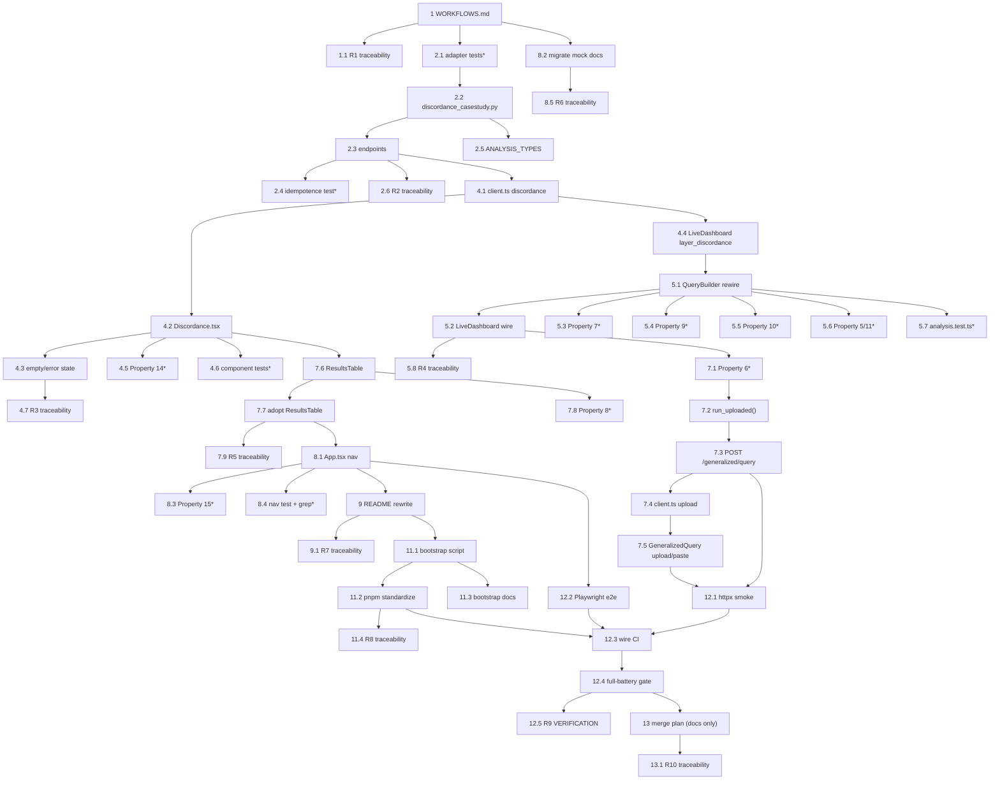

# Implementation Plan: Finalize Discordance MVP

## Overview

This plan finalizes the Track 2 "Omic Discordance Explained" MVP by surfacing deliverables that already exist as CLI-only pilots. The work is deliberately sequenced per the confirmed order:

1. **Documentation-first (R1):** author `WORKFLOWS.md` so the team understands every analysis path before building.
2. **Features-first (R2 → R3 → R4 → R5 → R6 → R7):** expose discordance via a read-only API, build the Discordance default view, unbundle the Live query builder against the live API, add generalized upload + a shared results table, retire the mock views, then rewrite the README.
3. **Features-then-hardening (R8 → R9):** a consolidated fresh-clone bootstrap + automated verification (httpx smoke + Playwright e2e) wired into CI.
4. **Merge plan last (R10):** documentation only, executes no git/gh.

The engines (`motrpac_probe`, `query_core`, standalone discordance modules) remain the single source of truth; nothing new computes statistics. The adapter serves **committed demo outputs** only — live recompute of the discordance catalog is an explicit out-of-scope follow-on.

Cross-cutting constraints R11 (source-of-truth boundary, species-derived study, both contrasts first-class, species+dataset+contrast on every result), R12 (frozen 52-column family, `q=0.0584` headline never upgraded, honest framing + guardrails + PTM caveat in UI, cohort separation), and R13 (per-feature ADR + VERIFICATION checkpoint + traceability rows, verify-before-claiming) are woven into each feature group as sub-tasks and acceptance notes — never deferred to the end.

**Grounding facts (from design.md — do not re-implement, WIRE/RENDER/verify):**
- `ColumnResult` already carries `camera_p`, `camera_fdr`, `species`, `dataset` → R5 table needs no backend change.
- `service._run_id` already excludes `include_nonsignificant` (R4 AC14) and includes `fdr_threshold` (R4 AC13).
- `layer_discordance` is already returned by `run_analysis` (R3 AC8).
- `apps/api/tests/test_api.py::test_point_to_evidence_to_source_chain` already exists; Playwright is its browser-level counterpart (R9 AC5).
- Authoritative counts (from `run_summary.json.catalog_classes`): `supported_concordant`=1, `supported_opposite`=0, `rna_response_protein_equivalent`=285, `indeterminate`=5642, `no_protein_measurement`=9228, `no_rna_measurement`=255. `model_metrics.csv` = exactly 6 rows.

**Legend:** Sub-tasks marked with `*` are optional (tests) and may be skipped for a faster MVP; the coding agent MUST NOT auto-implement `*` tasks and MUST implement non-`*` tasks. Documentation-only tasks are labeled **[DOCS ONLY]** and touch no runtime source.

---

## Tasks

- [x] 1. Author `WORKFLOWS.md` — trace every analysis workflow **[DOCS ONLY — no runtime source changes]** (Feature 1, first)
  - Create `WORKFLOWS.md` at the repository root before any feature-implementation source file is touched.
  - Include exactly one mermaid diagram + one numbered narrative for each of the five analysis types: `directed_signature`, `metabolomics_case_study`, `generalized_query`, discordance catalog + predictive model, PTM-parent audit.
  - For each type, trace the seven stages in order (entry point → module/function → data read → transform → output fields → provenance/run_id → UI view), writing "not applicable" for any missing stage rather than omitting it.
  - Add a request→response contract table for every API endpoint (inputs, outputs, triggering condition), covering existing endpoints plus the three planned discordance endpoints and the planned generalized upload endpoint.
  - Document the point→evidence→source chain as an ordered sequence and reference `test_point_to_evidence_to_source_chain` by name.
  - Label the discordance catalog, predictive model, and PTM-parent audit paths as CLI-only.
  - Do NOT add, remove, or alter any runtime source file in this task.
  - _Requirements: 1.1, 1.2, 1.3, 1.4, 1.5, 1.6, 1.7_
  - [x] 1.1 Record R1 traceability artifacts **[DOCS ONLY]**
    - Add the R1 ADR to `DECISIONS.md` (documentation-first decision, mermaid diagrams authored for reuse in R6).
    - Add a `VERIFICATION.md` checkpoint noting the `WORKFLOWS.md` structure grep check.
    - Add `REQUIREMENTS_TRACEABILITY.md` rows mapping R1 ACs → `WORKFLOWS.md` → structure check → status.
    - _Requirements: 13.1, 13.2, 13.3, 13.4_

- [x] 2. Expose discordance deliverables via read-only API (R2, R11.1)
  - [x] 2.1 Write Hypothesis property + parity unit tests for the discordance adapter (test-first)
    - **Property 1: read-fidelity + JSON-safety** — every adapter scalar equals the source cell (NaN/inf/unparseable → null); payload is valid JSON with only JSON-representable types. `# Feature: finalize-discordance-mvp, Property 1`. min 100 iterations, Hypothesis.
    - **Property 3: count parity + fixed 6-row grid** — per-class counts read from `catalog.csv` equal `run_summary.json.catalog_classes`; `model_metrics` has exactly 6 rows = {all_mapped, rna_responsive} × {zero, rna_only, temporal}. `# Feature: finalize-discordance-mvp, Property 3`. min 100 iterations.
    - **Property 4: event-class domain gate** — `catalog_available()` is True exactly when every `event_class` ∈ `KNOWN_EVENT_CLASSES`; one missing/malformed/out-of-set label → False and no catalog returned. `# Feature: finalize-discordance-mvp, Property 4`. min 100 iterations.
    - Unit tests: assert exact committed counts (`supported_concordant`=1, `supported_opposite`=0, `rna_response_protein_equivalent`=285, `indeterminate`=5642, `no_protein_measurement`=9228, `no_rna_measurement`=255) and the `parents[3]` path-coupling assertion (`Path(adapter).resolve().parents[3]` == repo root).
    - New file: `apps/api/tests/test_discordance.py`. Use Hypothesis (already the engine's PBT lib); never hand-roll PBT.
    - _Requirements: 2.7, 8.7; Properties 1, 3, 4_
  - [x] 2.2 Create the `discordance_casestudy.py` Option-1 read-only adapter
    - New file `apps/api/motrpac_probe_service/discordance_casestudy.py` mirroring `metab_casestudy.py`.
    - `_REPO = Path(__file__).resolve().parents[3]`; `DISCORDANCE_DIR = _REPO/"MoTrPAC Hackathon"/"generalized"/"discordance"`; `DEMO_DIR = demo_muscle_ee`; `PTM_DIR = demo_ptm_parent_ee`.
    - Read committed `catalog.csv`, `model_metrics.csv`, `model_predictions.csv`, `run_summary.json`, `ptm_parent_summary.csv`, `ptm_parent_candidates.csv`.
    - Define `CLASSIFICATION_CLASSES`, `COVERAGE_STATES`, `KNOWN_EVENT_CLASSES`; implement `catalog_available()`/`model_available()`/`ptm_available()` guards; `catalog_available()` validates the event-class domain and returns False on any missing/malformed/out-of-set label.
    - Implement `build_catalog_summary()`, `build_model()`, `build_ptm_parent()` returning JSON-safe dataclasses (`classification_counts` zero-filled; `coverage_counts` separate; `weak_prediction_note`; `occupancy_caveat`). Reuse a `_num`/`_clean` helper (NaN/inf → None). Compute NO statistics; `build_*()` raises `FileNotFoundError` when not available.
    - _Requirements: 2.1, 2.2, 2.3, 2.4, 2.5, 2.6, 2.8, 11.1; Properties 1, 3, 4_
  - [x] 2.3 Add the three GET-only discordance endpoints in `app.py`
    - `GET /api/discordance/catalog` → `build_catalog_summary()`, 404 when `not catalog_available()`.
    - `GET /api/discordance/model` → `build_model()`, 404 when `not model_available()`.
    - `GET /api/discordance/ptm-parent` → `build_ptm_parent()`, 404 when `not ptm_available()`.
    - Translate `FileNotFoundError` → 404 (match `get_metab_casestudy`). No `_RUNS` cache entry; honor no write/create/update/delete.
    - _Requirements: 2.1, 2.3, 2.4_
  - [x] 2.4 Write Property 2 idempotence/byte-stability test for the endpoints
    - **Property 2: read-only idempotence + byte-stability** — GET sequences never modify committed files (byte-identical before/after); repeated builds of a resource are equal. `# Feature: finalize-discordance-mvp, Property 2`. min 100 iterations, Hypothesis.
    - Add to `apps/api/tests/test_discordance.py`.
    - _Requirements: 2.1, 2.5; Property 2_
  - [x] 2.5 Add `discordance_catalog` to `ANALYSIS_TYPES` in `catalog.py`
    - Additive `ANALYSIS_TYPES["discordance_catalog"]` entry (label, cohort, engine, api/react flags, and the "serves committed demo; live recompute is a follow-on" note). Change no existing catalog behavior.
    - _Requirements: 2.1, 11.1_
  - [x] 2.6 Record R2 traceability artifacts **[DOCS ONLY]**
    - Add R2 ADR to `DECISIONS.md` (Option-1 adapter, GET-only, event-class domain gate, 4 classes + 2 coverage states reconciliation).
    - Add a `VERIFICATION.md` checkpoint (commands + exact committed counts asserted).
    - Add `REQUIREMENTS_TRACEABILITY.md` rows: R2 ACs → adapter/endpoints → `test_discordance.py` → status. Verify counts by running the tests before claiming (R13.4).
    - _Requirements: 13.1, 13.2, 13.3, 13.4_

- [x] 3. Checkpoint — discordance API
  - Ensure all `apps/api` tests pass, ask the user if questions arise.

- [x] 4. Build the Discordance main view with three-stage flow (R3, cross-cut R11/R12)
  - [x] 4.1 Add discordance client methods + response interfaces to `client.ts`
    - Add `discordanceCatalog()`, `discordanceModel()`, `discordancePtmParent()` plus `DiscordanceCatalogResponse`, `DiscordanceModelResponse`, `PtmParentResponse` interfaces (mirror the design's shapes: `classification_counts`, `coverage_counts`, `metrics`, `model_block`, `limitations`, `weak_prediction_note`, `summary_rows`, `candidate_count`, `occupancy_caveat`, `provenance`).
    - File: `apps/web/src/api/client.ts`.
    - _Requirements: 2.1, 3.3, 3.4, 3.6_
  - [x] 4.2 Create the `Discordance.tsx` three-stage view
    - New file `apps/web/src/components/Discordance.tsx` rendering Stage 1 (query builder over the available committed demo option(s), with UI text stating recompute is out of scope), Stage 2 (visualization), Stage 3 (interpretation), in that order.
    - Stage 1 fetches `discordanceCatalog()`; selectors present the committed demo(s) as selectable options.
    - Stage 2: class-count chart from `classification_counts`; model-metrics comparison chart from `model.metrics`; optional same-time RNA/protein scatter only if catalog rows are delivered (omit, never fake, if absent); PTM-parent timing from `ptm.summary_rows`.
    - Stage 3: render counts for all four classification classes including zero; model-metrics table (R2/MAE/RMSE for zero, rna_only, temporal); PTM-parent divergence summary; PTM occupancy caveat as visible text; a visible weak-prediction statement alongside the metrics (honest framing, R12.4).
    - _Requirements: 3.2, 3.3, 3.4, 3.5, 3.6, 3.7, 12.4_
  - [x] 4.3 Handle the discordance empty/error state
    - On query failure or no results, render an error/empty-state and render NONE of the event-class counts, model metrics, or PTM-parent summary.
    - _Requirements: 3.9_
  - [x] 4.4 Render `layer_discordance` in the Live view
    - In `LiveDashboard.tsx`, render the `layer_discordance` data already returned by `run_analysis` as a table/section (previously shown in zero views).
    - _Requirements: 3.8_
  - [x] 4.5 Write Property 14 fast-check test for Discordance view state
    - **Property 14: result completeness + empty-state exclusivity** — on success all four class counts (incl. zero) and each variant's R2/MAE/RMSE render; on failure/empty, an error/empty-state shows and none of counts/metrics/PTM render. `# Feature: finalize-discordance-mvp, Property 14`. min 100 iterations, fast-check.
    - _Requirements: 3.3, 3.4, 3.8, 3.9; Property 14_
  - [x] 4.6 Write Discordance component tests (Vitest + Testing Library)
    - Assert three-stage order (R3 AC2), PTM summary + occupancy caveat presence (R3 AC6, AC7), and weak-prediction text presence (R3 AC5).
    - _Requirements: 3.2, 3.5, 3.6, 3.7_
  - [x] 4.7 Record R3 traceability artifacts **[DOCS ONLY]**
    - Add R3 ADR to `DECISIONS.md` (three-stage flow, event-class reconciliation rendering, honest weak-prediction framing).
    - Add a `VERIFICATION.md` checkpoint; add `REQUIREMENTS_TRACEABILITY.md` rows R3 ACs → `Discordance.tsx`/`LiveDashboard.tsx` → tests → status. Verify before claiming (R13.4).
    - _Requirements: 13.1, 13.2, 13.3, 13.4_

- [x] 5. Unbundle the Live query builder against the live API (R4, cross-cut R11/R12)
  - [x] 5.1 Rewire `QueryBuilder.tsx` to `/api/catalog` + live comparison
    - Replace in-memory catalog usage with `/api/catalog`, reusing valid domain logic (`getStudyContext`, `reconcileQueryForSpecies`, `getVisualizationModeFromReturnedLayers`, `layerCapabilities`) from `domain/analysis.ts`.
    - Signature source is exactly one of: built-in example, pasted text, uploaded CSV. Example/paste → `signature_rows`; upload → `signature_csv_text`.
    - Invalid upload (empty, oversized, unparseable) is rejected, prior source retained, error shown.
    - Target selectors (species, omics, tissue, sex, timepoint) sourced from `/api/catalog`; total catalog failure disables all selectors with an error; partial degradation disables only the empty dimension(s).
    - FDR threshold constrained `0 < t <= 1` (document the UI-inclusive-upper vs API `gt=0, lt=1` boundary note); it is an analysis parameter (recorded in run_id via existing `service._run_id` — do not re-implement); include-nonsignificant is presentation-only (already excluded from run_id — do not re-implement).
    - Mandatory mapping-preview gate: call `/api/mappings/preview` and block `/api/comparisons` until the user confirms; preview failure blocks the comparison, retains selections, shows an error; terms with multiple candidates are all surfaced for confirmation, none auto-selected.
    - Species-derived study (R11.2/R11.3): no acute/chronic input control; both contrasts first-class, no "healthy gene set" (R11.4).
    - _Requirements: 4.1, 4.2, 4.3, 4.4, 4.5, 4.6, 4.7, 4.8, 4.9, 4.10, 4.11, 4.12, 4.13, 4.14, 11.2, 11.3, 11.4_
  - [x] 5.2 Wire `LiveDashboard.tsx` to the live query builder
    - Remove the hardcoded request (`example_name="pah_muscle_malenfant2015"`, `target_species="rat"`, `fdr_threshold=0.05`) and drive results from the rewired `QueryBuilder.tsx`.
    - _Requirements: 4.9, 12.4_
  - [x] 5.3 Write Property 7 fast-check test (source exclusivity / field mapping)
    - **Property 7** — exactly one signature source active; example/paste → `signature_rows`, upload → `signature_csv_text`; invalid upload rejected, prior source unchanged, error surfaced. `# Feature: finalize-discordance-mvp, Property 7`. min 100 iterations, fast-check.
    - _Requirements: 4.1, 4.2, 4.3, 4.4; Property 7_
  - [x] 5.4 Write Property 9 fast-check test (catalog-driven selector enablement)
    - **Property 9** — each selector enabled iff its dimension has ≥1 value; empty dimension disables only its own selector; total failure disables all + surfaces error. `# Feature: finalize-discordance-mvp, Property 9`. min 100 iterations, fast-check.
    - _Requirements: 4.6, 4.7; Property 9_
  - [x] 5.5 Write Property 10 fast-check test (mapping-preview confirmation gate)
    - **Property 10** — `/api/comparisons` not called until preview confirmed; multi-candidate terms all surfaced, none auto-selected; preview failure blocks comparison, selections retained. `# Feature: finalize-discordance-mvp, Property 10`. min 100 iterations, fast-check.
    - _Requirements: 4.10, 4.11, 4.12; Property 10_
  - [x] 5.6 Write Property 5 / Property 11 Hypothesis tests (run_id + species-derived study)
    - **Property 5: run_id determinism** — same signature+params → same run_id; changing `fdr_threshold` changes it; toggling `include_nonsignificant` does not. `# Feature: finalize-discordance-mvp, Property 5`. min 100 iterations, Hypothesis (verifies existing `service._run_id`).
    - **Property 11: species-derived study** — rat → chronic, human → acute, derived on backend from species alone. `# Feature: finalize-discordance-mvp, Property 11`. min 100 iterations, Hypothesis.
    - File: `apps/api/tests/test_service.py` (extend) or `test_discordance.py`.
    - _Requirements: 4.13, 4.14, 11.2, 11.3; Properties 5, 11_
  - [x] 5.7 Extend `analysis.test.ts` for the rewired catalog-driven logic
    - Cover FDR boundary `0 < t <= 1` and reconciled catalog-driven selection paths.
    - _Requirements: 4.8_
  - [x] 5.8 Record R4 traceability artifacts **[DOCS ONLY]**
    - Add R4 ADR to `DECISIONS.md` (live rewire, mapping-preview gate, FDR-in-run_id boundary note).
    - Add a `VERIFICATION.md` checkpoint; add `REQUIREMENTS_TRACEABILITY.md` rows R4 ACs → `QueryBuilder.tsx`/`LiveDashboard.tsx`/`service._run_id` → tests → status. Verify before claiming (R13.4).
    - _Requirements: 13.1, 13.2, 13.3, 13.4_

- [x] 6. Checkpoint — Live query builder
  - Ensure all web and `apps/api` tests pass, ask the user if questions arise.

- [x] 7. Generalized query upload + shared results-table consistency (R5, cross-cut R11.5/R12)
  - [x] 7.1 Write Property 6 Hypothesis test for generalized upload schema enforcement (test-first)
    - **Property 6** — the endpoint runs the query iff the signature conforms to the query_core schema; non-conforming input is rejected without running, returns an error naming the unmet schema requirement, prior signature unchanged. `# Feature: finalize-discordance-mvp, Property 6`. min 100 iterations, Hypothesis; mock `query_core.engine.run_query` to keep iterations cheap.
    - File: `apps/api/tests/test_generalized.py` (extend).
    - _Requirements: 5.1, 5.2; Property 6_
  - [x] 7.2 Add `run_uploaded()` to `generalized_query.py`
    - `run_uploaded(signature_csv_text, *, tissue, reference_contrast_category, reference="default")` mirroring `run_bundled`: guard on `available()`; validate against the query_core schema via `_validate_query_core_schema` returning `(ok, failing_requirement)`; on failure raise `SchemaError(which)`; on success write a content-addressed temp file (sha256), run `_run_query`, normalize identically to `run_bundled`, and clean up the temp file. Compute no statistics (query_core is source of truth).
    - _Requirements: 5.1, 5.2, 11.1_
  - [x] 7.3 Add `POST /api/generalized/query` endpoint in `app.py`
    - Accept `{ signature_csv_text, tissue, reference_contrast_category, reference }`; return the normalized `run_bundled`-shaped payload on success; return 422 identifying the failing schema requirement on non-conforming input (translate `SchemaError`).
    - _Requirements: 5.1, 5.2_
  - [x] 7.4 Add `generalizedQueryUpload()` to `client.ts`
    - Typed `generalizedQueryUpload(body)` → `POST /generalized/query`; add/extend the `GeneralizedQueryResult` response interface as needed.
    - _Requirements: 5.1, 5.2_
  - [x] 7.5 Add upload + paste controls to `GeneralizedQuery.tsx`
    - Add an upload control and a paste control alongside the existing bundled-signature picklist; submit via `generalizedQueryUpload()`. A pasted signature that cannot be parsed is rejected with a parse-failure indication WITHOUT clearing the pasted text.
    - _Requirements: 5.3, 5.4_
  - [x] 7.6 Create the shared `ResultsTable` component
    - New reusable component used across Live, Generalized, Discordance, Metabolomics.
    - `camera_p` (raw nominal p) column immediately adjacent to `camera_fdr` (BH q), each with a visible header label: BH q = adjusted over the frozen 52-column family; raw p = nominal/unadjusted.
    - Distinctly labeled `species` and `dataset` columns; every rendered value carries species + dataset + contrast; the row model type REQUIRES those fields so the component can never render a bare value.
    - Cross-species results display the ortholog-link relation.
    - Reads existing `ColumnResult` fields (`camera_p`, `camera_fdr`, `species`, `dataset`) — no backend change.
    - Where a headline is surfaced, it is the `q = 0.0584` not-significant result; the 16-column `q = 0.0413` is only ever a labeled sensitivity analysis (R12.2, R12.3).
    - _Requirements: 5.5, 5.6, 5.7, 5.8, 5.9, 11.5, 12.2, 12.3, 12.5_
  - [x] 7.7 Adopt `ResultsTable` in Live, Generalized, Discordance, and Metabolomics views
    - Replace the per-view result tables with the shared component so the labeling invariants hold everywhere. Keep cohorts separate (muscle protein / plasma metabolomics / blood distinct) in presentation (R12.5).
    - _Requirements: 5.5, 5.6, 5.7, 5.8, 5.9, 11.5, 12.5_
  - [x] 7.8 Write Property 8 fast-check test (never a bare value + ortholog link)
    - **Property 8** — every ResultsTable row has species + dataset + contrast; no value renders without all three; cross-species rows show the ortholog-link relation. `# Feature: finalize-discordance-mvp, Property 8`. min 100 iterations, fast-check.
    - _Requirements: 5.6, 5.7, 5.8, 5.9, 11.5, 12.5; Property 8_
  - [x] 7.9 Record R5 traceability artifacts **[DOCS ONLY]**
    - Add R5 ADR to `DECISIONS.md` (generalized upload, content-addressed temp file, shared ResultsTable invariant).
    - Add a `VERIFICATION.md` checkpoint; add `REQUIREMENTS_TRACEABILITY.md` rows R5 ACs → `generalized_query.run_uploaded`/endpoint/`ResultsTable` → tests → status. Verify before claiming (R13.4).
    - _Requirements: 13.1, 13.2, 13.3, 13.4_

- [x] 8. Retire mock design views and consolidate navigation (R6, cross-cut R12)
  - [x] 8.1 Remove mock views and consolidate nav in `App.tsx`
    - Remove views `architecture(01)`, `technical(02)`, `workflow(03)`, `dashboard(04)`, `slide(08)` from nav and rendering.
    - Make Discordance the default view on initial load; present exactly five nav entries: Discordance (default), Live, Generalized, Metabolomics, About/Methods.
    - Direct navigation to a retired view does not render it: redirect to the last-used live view (persisted in `sessionStorage`), falling back to Discordance.
    - Ensure no hardcoded `PPARGC1A`, `SOD2`, `COL1A1` appear in any navigable view.
    - About/Methods links to the migrated documentation (task 8.2).
    - _Requirements: 6.1, 6.2, 6.3, 6.6, 6.7, 3.1_
  - [x] 8.2 Migrate removed mock-view content into documentation **[DOCS ONLY]**
    - Move the content of views 01–04+08 into a documentation file, reusing the R1 mermaid diagrams verbatim (no diagram-source changes) and preserving Figma-Make provenance attribution per migrated view.
    - _Requirements: 6.4, 6.5, 6.7_
  - [x] 8.3 Write Property 15 fast-check test (retired-view redirect resolution)
    - **Property 15** — direct navigation to a retired view resolves to the last-used live view if present, else Discordance; never a retired view. `# Feature: finalize-discordance-mvp, Property 15`. min 100 iterations, fast-check.
    - _Requirements: 6.2; Property 15_
  - [x] 8.4 Write nav component test + banned-identifier grep
    - Assert nav has exactly 5 entries with Discordance default (R6 AC1, AC6); assert no `PPARGC1A`/`SOD2`/`COL1A1` in any navigable view (component test + a source grep over navigable components).
    - _Requirements: 6.1, 6.3, 6.6_
  - [x] 8.5 Record R6 traceability artifacts **[DOCS ONLY]**
    - Add R6 ADR to `DECISIONS.md` (mock-view retirement, redirect rule, mock content migrated with Figma-Make attribution).
    - Add a `VERIFICATION.md` checkpoint; add `REQUIREMENTS_TRACEABILITY.md` rows R6 ACs → `App.tsx`/migrated doc → tests → status. Verify before claiming (R13.4).
    - _Requirements: 13.1, 13.2, 13.3, 13.4_

- [x] 9. Rewrite the root `README.md` anchored to Track 2 **[DOCS ONLY — no runtime source changes]** (R7)
  - Name the Track 2 "Omic Discordance Explained" challenge in the first section (content before the second heading) as the anchoring topic.
  - Present the discordance catalog + predictive model as the headline deliverable, before any other deliverable.
  - State the cross-cohort association framing (not a PAH treatment efficacy claim); state cohorts are analyzed separately and not merged; state the PTM occupancy caveat applies.
  - Include exactly one navigable Markdown link to each of `WORKFLOWS.md`, `DECISIONS.md`, `VERIFICATION.md`, `METABOLOMICS.md`, and `RUN_LOCAL.md`.
  - Ensure no heading is followed by empty content.
  - _Requirements: 7.1, 7.2, 7.3, 7.4, 7.5, 7.6_
  - [x] 9.1 Record R7 traceability artifacts **[DOCS ONLY]**
    - Add R7 ADR to `DECISIONS.md`; add a `VERIFICATION.md` checkpoint (README structure + link resolvability grep); add `REQUIREMENTS_TRACEABILITY.md` rows R7 ACs → `README.md` → structure check → status.
    - _Requirements: 13.1, 13.2, 13.3, 13.4_

- [x] 10. Checkpoint — features complete
  - Ensure all web and `apps/api` tests pass, ask the user if questions arise.

- [x] 11. Fresh-clone hardening and bootstrap (R8)
  - [x] 11.1 Author the one-command bootstrap script
    - Create a bootstrap script that performs editable installs of `hackathon/tool` and `apps/api`, fetches the mprobe store, and completes a smoke check within 600 seconds.
    - On any failed editable install: halt, exit non-zero, emit a message naming the failed target, run no subsequent steps.
    - On failed/unavailable mprobe store fetch: halt, exit non-zero, emit a store-fetch error.
    - On smoke-check completion: exit zero iff all checks pass, non-zero naming the failed check otherwise.
    - _Requirements: 8.1, 8.2, 8.3, 8.4_
  - [x] 11.2 Standardize on pnpm across setup + CI
    - Replace all `npm install`/`npm test`/`npm run build` steps in `.github/workflows/ci.yml` with the pnpm equivalents (honoring the committed `apps/web/pnpm-lock.yaml`), leaving no `npm` invocation in setup instructions or CI.
    - _Requirements: 8.6_
  - [x] 11.3 Write bootstrap documentation **[DOCS ONLY]**
    - Document the bootstrap invocation, referenced by a resolvable link from BOTH `README.md` and `RUN_LOCAL.md`.
    - Document the `parents[3]` path-coupling constraint (the required directory-depth relationship between adapter files and referenced paths) so a reader can verify whether a file location satisfies it.
    - _Requirements: 8.5, 8.7_
  - [x] 11.4 Record R8 traceability artifacts **[DOCS ONLY]**
    - Add R8 ADR to `DECISIONS.md` (single package manager = pnpm, bootstrap contract, path-coupling); add a `VERIFICATION.md` checkpoint (bootstrap run + timing + single-package-manager grep); add `REQUIREMENTS_TRACEABILITY.md` rows R8 ACs → bootstrap script/`ci.yml`/docs → checks → status.
    - _Requirements: 13.1, 13.2, 13.3, 13.4_

- [x] 12. Automated verification wired into CI (R9, cross-cut R13)
  - [x] 12.1 Write the httpx API smoke script
    - Scripted httpx check that requests every documented endpoint (including the three discordance endpoints and the generalized upload endpoint) and asserts each returns success.
    - Assert headline `q == 0.0584 ± 0.0001`, the discordance per-class integer counts (`supported_concordant`=1, `supported_opposite`=0, `rna_response_protein_equivalent`=285, `indeterminate`=5642), and the metabolomics null result.
    - On any non-success response or value mismatch, fail and name the offending endpoint/value. (Single execution, not 100 iterations — verifies wiring + exact values.)
    - _Requirements: 9.1, 9.2, 9.3_
  - [x] 12.2 Write the Playwright end-to-end test
    - Boot API + web; per live view (Discordance, Live, Generalized, Metabolomics) assert real data renders (not empty/placeholder/error).
    - Assert the browser-level point→evidence→source chain: select a data point, verify linked evidence displayed, verify linked source displayed (browser counterpart to `test_point_to_evidence_to_source_chain`).
    - _Requirements: 9.4, 9.5_
  - [x] 12.3 Wire httpx smoke + Playwright e2e into CI
    - Add both as CI jobs in `.github/workflows/ci.yml` wired to run on each pull request (using pnpm per task 11.2).
    - _Requirements: 9.6_
  - [x] 12.4 Implement the full-battery gate + golden-hash guard in CI
    - Gate marks complete only at engine exactly 122 passed / 34 skipped, `apps/api` zero failures, web tests + build zero failures; any deviation blocks completion/merge.
    - If the engine is modified, confirm `analysis.py` is byte-identical to the golden reference by content-hash comparison.
    - _Requirements: 9.7, 9.8, 9.9_
  - [x] 12.5 Record the R9 `VERIFICATION.md` checkpoint + traceability **[DOCS ONLY]**
    - Record the exact commands run, resulting test counts, and content hashes for the verification battery in `VERIFICATION.md`.
    - Add R9 ADR to `DECISIONS.md`; add `REQUIREMENTS_TRACEABILITY.md` rows R9 ACs → smoke/e2e/CI gate → status. Do not claim counts before running the battery (R13.4).
    - _Requirements: 9.10, 13.1, 13.2, 13.3, 13.4_

- [x] 13. Author the merge-to-main plan and pre-merge checklist **[DOCS ONLY — MUST NOT execute any git or gh command]** (R10)
  - Create a merge-plan document. This task is documentation only and MUST NOT trigger, invoke, or execute any git, gh, or shell command; it only writes the plan/checklist text.
  - Require, as documented preconditions: all verification gates passing; `git status` reporting zero modified/staged/untracked/deleted files; the local branch zero commits ahead of upstream.
  - Document that the merge is blocked (and which precondition failed) if any gate is non-passing, the tree has uncommitted/untracked files, or the branch is ahead of upstream.
  - Require that no rebase replays commits over `origin/t3code/build-motrpac-probe-tool`.
  - Include the exact `gh pr create` command (as text only) with base `main` and head `integration/exercise-signature-explorer`.
  - Include a PR description template with exactly three labeled sections: summary, what-was-tested, deferred-items.
  - _Requirements: 10.1, 10.2, 10.3, 10.4, 10.5, 10.6_
  - [x] 13.1 Record R10 traceability artifacts **[DOCS ONLY]**
    - Add R10 ADR to `DECISIONS.md` (merge plan is documentation-only, no execution); add a `VERIFICATION.md` checkpoint (merge-plan structure + no-execution check); add `REQUIREMENTS_TRACEABILITY.md` rows R10 ACs → merge-plan doc → structure check → status.
    - _Requirements: 13.1, 13.2, 13.3, 13.4_

- [x] 14. Final checkpoint — full verification battery
  - Ensure all tests pass (engine 122 passed / 34 skipped, `apps/api` zero failures, web zero failures) and the `VERIFICATION.md` checkpoints are complete; ask the user if questions arise.

## Notes

- Tasks marked with `*` are optional (property/unit/integration tests) and can be skipped for a faster MVP; the coding agent MUST NOT auto-implement `*` sub-tasks and MUST implement non-`*` sub-tasks.
- Tasks labeled **[DOCS ONLY]** touch no runtime source. Task 1 (WORKFLOWS.md), task 9 (README), and task 13 (merge plan) are documentation-only; task 13 additionally MUST NOT execute any git/gh command.
- Each task references specific requirement sub-clauses and, where relevant, the design property numbers for traceability.
- Cross-cutting R11/R12 are woven into the feature tasks (species-derived selection + both-contrasts in task 5.1; honest framing / frozen family / headline invariant / PTM caveat in tasks 4.2, 5.2, 7.6). R13 is woven in as a per-feature ADR + VERIFICATION checkpoint + traceability-rows sub-task at the end of every feature group; verify-before-claiming applies throughout.
- V1 scope boundary respected: the discordance adapter serves COMMITTED demo outputs only; no task performs live recompute of the discordance catalog (documented follow-on).
- Do NOT re-implement `service._run_id` (already excludes `include_nonsignificant`, includes `fdr_threshold`), `layer_discordance` (already returned), or `ColumnResult` columns (`camera_p`/`camera_fdr`/`species`/`dataset` already present) — tasks WIRE/RENDER/verify these.
- Each property test is a single test at min 100 iterations, tagged `# Feature: finalize-discordance-mvp, Property {n}: {property_text}`, using Hypothesis (Python) or fast-check (TypeScript); never hand-rolled.

## Task Dependency Graph

Ordering intent: WORKFLOWS.md (R1) → R2 → R3 → R4 → R5 → R6 → R7 → R8 → R9 → R10, with cross-cutting R11–R13 woven into each feature group. Checkpoints (3, 6, 10, 14) and top-level parent tasks are not scheduled; only leaf sub-tasks and standalone leaf tasks appear below.



```json
{
  "waves": [
    { "id": 0, "tasks": ["1.1", "2.1", "8.2"] },
    { "id": 1, "tasks": ["2.2"] },
    { "id": 2, "tasks": ["2.3", "2.5"] },
    { "id": 3, "tasks": ["2.4", "2.6", "4.1"] },
    { "id": 4, "tasks": ["4.2", "4.4"] },
    { "id": 5, "tasks": ["4.3", "4.5", "4.6", "7.6"] },
    { "id": 6, "tasks": ["4.7", "5.1", "7.8"] },
    { "id": 7, "tasks": ["5.2", "5.3", "5.4", "5.5", "5.6", "5.7", "7.1"] },
    { "id": 8, "tasks": ["5.8", "7.2"] },
    { "id": 9, "tasks": ["7.3"] },
    { "id": 10, "tasks": ["7.4", "7.7"] },
    { "id": 11, "tasks": ["7.5", "7.9", "8.1"] },
    { "id": 12, "tasks": ["8.3", "8.4", "8.5", "9"] },
    { "id": 13, "tasks": ["9.1", "11.1"] },
    { "id": 14, "tasks": ["11.2", "11.3", "12.1", "12.2"] },
    { "id": 15, "tasks": ["11.4", "12.3"] },
    { "id": 16, "tasks": ["12.4"] },
    { "id": 17, "tasks": ["12.5", "13"] },
    { "id": 18, "tasks": ["13.1"] }
  ]
}
```
