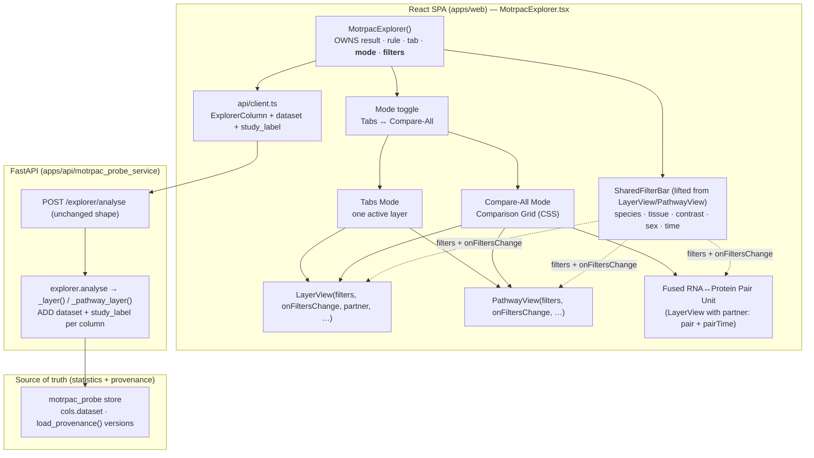
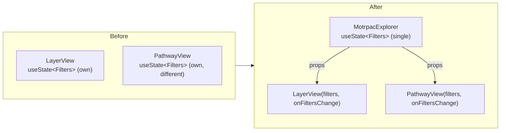
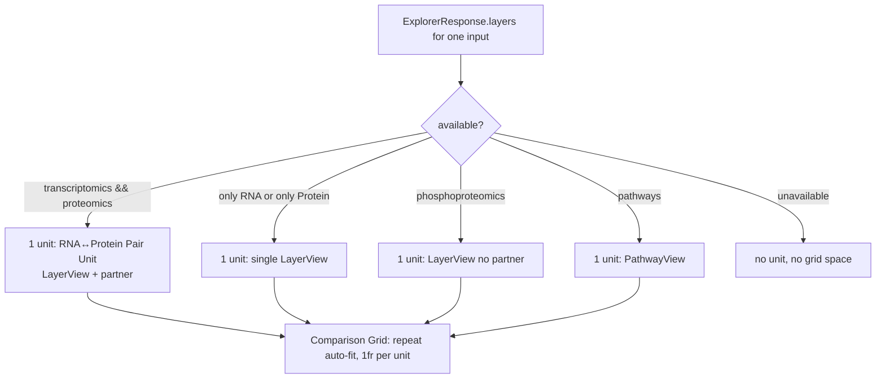

# Design Document: Multi-Omic Comparison View

## Overview

This feature extends the **MoTrPAC Explorer** (`apps/web/src/components/MotrpacExplorer.tsx`) with a generalized multi-omic comparison view, built on top of the RNA↔protein side-by-side co-view that the upstream `motrpac-explorer` branch already shipped and that is now merged into this branch. It is a deliberately **delta-only** feature: the merge already delivered the two-layer pair co-view (the `pair` HeatGrid and `pairTime` SmallMultiples that match molecules across transcriptomics and proteomics by `species|tissue|category|time|sex`), and this design builds ON that reality rather than re-specifying it.

Two capabilities are added:

- **Feature A′ (UI-only) — Compare-All Mode + shared filter bar.** A mode toggle switches the Explorer from single-tab viewing (Tabs Mode) to a responsive **Comparison Grid** (Compare-All Mode) that renders every available layer's *existing* view simultaneously. The single filter bar — species, tissue, contrast, sex, time — is **lifted out of each `LayerView`/`PathwayView` into the parent `MotrpacExplorer`** so all panels always show the same biological context. In Compare-All Mode, RNA and protein render as **one fused RNA↔Protein Pair Unit** (reusing the existing `partner` pair views) occupying a single grid cell, while phospho and pathways occupy their own cells.

- **Feature B (variant B2, backend) — store-sourced study/dataset labels.** Two fields, `dataset` and `study_label`, are added to each `ExplorerColumn` built in `explorer.py` (`_layer()` and `_pathway_layer()`), sourced from the motrpac_probe store's own dataset code and provenance version, then surfaced in panel headers/chips, on-screen results, and CSV exports.

The design is **additive and read-only** with respect to the statistical engine. Feature A′ introduces **no new API request shape, no new chart types, no new statistics, and no new classification** — the existing `ExplorerResponse` already carries every layer in one payload, so showing layers side by side adds no computation. Feature B is a small backend addition that only *labels* columns from store-held provenance; it computes no statistics and does not hardcode study names in React.

### Guiding principles (carried from the sibling `finalize-discordance-mvp` design and this spec's requirements)

- **Source-of-truth boundary (R9):** the Web_Client and Explorer_Backend never compute statistics; the Store (`motrpac_probe`) remains the single source of truth for all statistics **and** for the study/dataset labels. Labels are read from the store, never hardcoded in React (the whole reason B2 is chosen over deriving labels in the frontend).
- **Honest labeling (R5, R6, R10):** every displayed result carries species · study/dataset · tissue · contrast (category) · sex · time. `category` is the **contrast** (EE-CON, EE-EE, TRAIN-SED, CON-CON, …); `sex` is a **separate** axis (male/female for rat, `all` for human). "male vs female" is never a contrast.
- **Honest empty states (R2.6, R10.2):** a filter selection that matches no comparison for a layer yields that panel's **existing** empty/no-match state, never an error.
- **Traceability discipline (R11):** the feature gets an ADR in `DECISIONS.md`, a `VERIFICATION.md` checkpoint with exact commands and counts, and rows in `REQUIREMENTS_TRACEABILITY.md`; nothing is claimed before the relevant test/command is run.

### Scope boundaries (R8 — intentional limitations)

- **No cross-omic concordance or classification summary** is added (R8.1). This feature only *displays* the existing per-layer views together.
- **No drag-to-resize / splitter panes** for the Comparison Grid (R8.2); the even split is pure responsive CSS.
- **No API request-shape change** (R8.3) and **no new or altered per-omic statistic/classification** (R8.4); `ExplorerResponse` already contains every layer.
- The feature **does not modify** the Discordance, Live, Generalized, or Metabolomics views (R8.5), and **does not re-specify or reimplement** the RNA↔Protein Pair View beyond not regressing it (R8.6, R3.1).

### Verify-before-claiming note on the store field

`explorer.py` already reads `c.dataset` off the store columns (`_category()` branches on `c.dataset == "rat_train"`, and `_columns()` computes `rat = c.dataset == "rat_train"`). The store's `column_index()` groups a `dataset` column with values `human_acute` / `rat_train` (`store.py`, `CAT_COLS`/`column_index`), so **`dataset` is a confirmed store field** and needs no discovery. The store columns do **not** carry a per-column version string; the study version lives in `store.load_provenance()` under the keys `MotrpacRatTraining6moData` and `MotrpacHumanPreSuspensionAnalysis`. The design therefore sources `study_label` in the backend from `dataset` + `load_provenance()` (see Data Models → `study_label` derivation). **Confirm during implementation** that `store.load_provenance()` returns those two keys in the running store build; if a version is absent, the deterministic fallback (R4.7) applies.

---

## Architecture

### System context (unchanged request path)

The Explorer is one React view (`apps/web/src/components/MotrpacExplorer.tsx`) talking to the FastAPI service via a single existing endpoint, `POST /explorer/analyse` (`api.explorerAnalyse`, `client.ts`). That endpoint returns one `ExplorerResponse` containing **every** layer (`analyse()` in `explorer.py` builds `transcriptomics`, `proteomics`, `phosphoproteomics`, `metabolomics`, `pathways`, `epigenomics`). This feature changes **only**:

1. **The client** — how the Explorer renders those layers (mode + shared filter state) and two new type fields.
2. **The backend column builders** — two new label fields per column.

No new endpoint, no new request field.



### The state-lift (the crux of R2)

Today each panel owns its own filter state:

- `LayerView` holds `const [f, setF] = useState<Filters>(() => defaults(cols, values, cols, undefined, hint))` and rebuilds it on `[layer]` via a `useEffect`. Its `pick(key, value)` helper resolves a change — notably a **species** change rebuilds the whole `Filters` through `defaults(cols.filter(c => c.species === value), …)`, while a **tissue** change resets `time` to `ALL`.
- `PathwayView` holds a **separate** `useState<Filters>` seeded to human/blood/RNA/VS-CON.

This feature lifts a single `Filters` object into `MotrpacExplorer` and passes it (plus a change handler) down as props. This is the minimal, honest way to make one bar drive every panel simultaneously.



**Props vs context (decision):** the shared `Filters` are passed as **props**, not React context. Rationale: the Explorer is a single self-contained component tree with a shallow hierarchy (`MotrpacExplorer → LayerView/PathwayView`, two levels), the consumers are few and known, and props keep the data flow explicit and trivially testable (a test can render `LayerView` with a fixed `filters` prop and assert its selection). Context would add indirection and a provider with no reuse benefit at this size. Recorded as an ADR under R11.

### Compare-All rendering (the "unit" model, R1 + R3)

The Comparison Grid renders a list of **units**. A *unit* is one grid cell:

- If **both** transcriptomics and proteomics are available for the current result, they collapse into **one** fused **RNA↔Protein Pair Unit** — a single `LayerView` given its `partner`, which already renders the `pair` HeatGrid and `pairTime` SmallMultiples. This is the two-layer case of the general comparison (R3.1, R3.6): there is **no second molecule-pairing implementation**.
- **Phosphoproteomics** is its own unit (a `LayerView` with no partner).
- **Pathways** is its own unit (a `PathwayView`).
- If only one of RNA / protein is available, that single layer is its own unit (no partner to fuse with).
- **Unavailable layers contribute no unit** and reserve no grid space (R1.7).

The grid splits width evenly across the *units* (the fused pair counting as one — R3.7) using responsive CSS (below). Every unit renders the **existing** view; no new chart type is introduced (R1.6, R8.4).



### Responsive grid (CSS lives in `LiveDashboard.css`)

The Explorer's `lr-*`/`xp-*` styles live in `apps/web/src/components/LiveDashboard.css`. Today `.lr-cards` is `display: grid; grid-template-columns: minmax(0, 1fr)` (single column). The Comparison Grid adds a sibling modifier class (e.g. `.lr-cards.xp-grid`) that switches to an even multi-column track and reflows on narrow viewports, matching the file's existing responsive idiom (`@media (max-width: 860px)` and `repeat(auto-fit, minmax(...))` as already used by `.lr-tiles`). Even split = equal `1fr` tracks; reflow = fewer columns at the existing 860 px breakpoint (e.g. 2-up → single column), satisfying R1.4/R1.5 with no splitter (R8.2).

---

## Components and Interfaces

### Backend

#### `explorer.py` — `_layer()` column builder (R4.1, R4.3, R4.5, R4.7)

`_layer()` builds each column `row = dict(id=c.column_id, species=c.species, tissue=…, …, sex=c.sex_label, …)` from a `_columns(codes)` row `c` (which carries `c.dataset`, `c.species`). Add two keys to that dict:

```python
row = dict(
    id=c.column_id, species=c.species, tissue=c.tissue,
    tissue_label=TISSUE_LABEL.get(c.tissue, c.tissue),
    layer=LAYER_LABEL.get(c.layer, c.layer), category=c.category,
    exercise=EXERCISE[c.category], time=c.time_key, time_label=c.time_label,
    time_rank=int(c.time_rank), sex=c.sex_label,
    dataset=c.dataset,                       # NEW — store dataset code (R4.3)
    study_label=_study_label(c.dataset),     # NEW — store provenance (R4.4, R4.5, R4.7)
    n_tested=n_col, n_measured=int(s.n_measured),
    set_t=_f(s.camera_t), set_p=_f(s.camera_p), set_bh=_f(bh[j]), set_bonferroni=_f(bonf[j]),
)
```

`_columns()` already exposes `c.dataset`, so no store schema change is needed.

#### `explorer.py` — `_pathway_layer()` column builder (R4.2)

`_pathway_layer()` builds its columns from the precomputed pathway table, which is human-only (`species="human"`, hardcoded in the current dict comprehension). Its columns carry no `dataset` field today, so it is derived from species. Add:

```python
columns = [dict(
    id=f"{c.tissue}|{c.assay}|{c.category}|{c.time}", species="human", tissue=c.tissue,
    tissue_label={"muscle": "Skeletal muscle"}.get(c.tissue, c.tissue.capitalize()),
    layer=ASSAY_LABEL.get(c.assay, c.assay), category=c.category, exercise=EXERCISE[c.category],
    time=c.time, time_label=c.time_label, time_rank=int(c.time_rank), sex="all",
    dataset=_dataset_for_species("human"),      # NEW → "human_acute"
    study_label=_study_label(_dataset_for_species("human")),  # NEW
) for c in cols.itertuples()]
```

A tiny helper `_dataset_for_species(species)` returns `"human_acute"` for human and `"rat_train"` for rat, matching the store's own convention (`store.py`: `species = np.where(dataset == "human_acute", "human", "rat")`, and `metab._panel_columns`: `ds = "human_acute" if species == "human" else "rat_train"`). This keeps the pathway path's `dataset` value consistent with the layer path without inventing a code.

#### `explorer.py` — `_study_label()` helper (R4.4, R4.7, R9.2)

New module-level helper that sources the label from store provenance, **not** from a React or Python literal study name:

```python
from motrpac_probe import store as _store_mod   # already a dependency via metab

_DATASET_STUDY = {                       # dataset code → (human phrase, provenance version key)
    "rat_train":   ("endurance training", "MotrpacRatTraining6moData"),
    "human_acute": ("acute exercise",     "MotrpacHumanPreSuspensionAnalysis"),
}

@lru_cache(maxsize=1)
def _provenance() -> dict:
    try:
        return _store_mod.load_provenance()   # {"MotrpacRatTraining6moData": "2.0.0", …}
    except Exception:
        return {}

def _study_label(dataset: str) -> str:
    phrase_key = _DATASET_STUDY.get(dataset)
    if phrase_key is None:
        return dataset                                  # unknown dataset → fall back to code (R4.7)
    phrase, version_key = phrase_key
    version = _provenance().get(version_key)
    if not version:
        return dataset                                  # no store version → fall back to code (R4.7)
    return f"{phrase} ({version})"                       # e.g. "endurance training (2.0.0)"
```

Notes:
- The *phrase* ("endurance training" / "acute exercise") is a display mapping keyed by the store's own dataset code; the **version** — the part that makes the label a real study identifier — comes from the store provenance. This satisfies "identify the rat endurance-training study / human acute-exercise study" (R4.5) while keeping the authoritative version store-sourced (R4.4, R9.2).
- If provenance lacks a version (fresh/partial store build), `study_label` is set to the `dataset` code (`"rat_train"` / `"human_acute"`) — never omitted, never fabricated (R4.7).
- No statistics are computed here (R9.1).

The existing footnote in `MotrpacExplorer.tsx` currently hardcodes the version strings (`MotrpacHumanPreSuspensionAnalysis 2.0.8; rat: MotrpacRatTraining6moData 2.0.0`). That footnote is a page-level citation and is preserved as-is (R10.3); the per-panel `study_label` used by chips/tables/CSV comes from the store, satisfying R5.5/R9.2 (the frontend does not derive the per-result study label).

### Frontend

#### `client.ts` — `ExplorerColumn` type (R4.6)

Add the two fields to the interface (`~line 412`):

```typescript
export interface ExplorerColumn {
  id: string; species: string; tissue: string; tissue_label: string; layer: string; category: string; exercise: string;
  time: string; time_label: string; time_rank: number; sex: string;
  dataset: string; study_label: string;   // NEW (R4.6)
  n_tested?: number; n_measured?: number;
  set_t?: number | null; /* … unchanged … */
}
```

`ExplorerResponse`, `ExplorerLayer`, and `api.explorerAnalyse` are otherwise unchanged (R8.3).

#### `MotrpacExplorer.tsx` — parent component (R1, R2)

New parent state and the lifted filter object:

```typescript
type Mode = "tabs" | "compare";
const [mode, setMode] = useState<Mode>("tabs");          // R1.2 default Tabs Mode
const [filters, setFilters] = useState<Filters | null>(null);  // lifted from LayerView (R2.2)
```

- **`filters` initialization / re-derivation.** The `defaults(cols, values, allCols, species?, hint?)` function currently lives in module scope and is called inside `LayerView`. It stays a pure module function. When a result loads (or the active input changes), the parent seeds `filters` from the *active input's primary layer* using `defaults(...)` — reproducing today's seeding, just hoisted. Because `defaults()` needs a layer's `cols`/`values`, the parent computes it from the first available layer of the active input (the same layer Tabs Mode would show first).
- **Species-change resolution moves to the parent.** The `pick("species", v)` branch in `LayerView` (which rebuilds `Filters` via `defaults(cols.filter(c => c.species === v), …)`) and the `tissue`-change reset (`time: ALL`) move into the parent's `onFiltersChange(next)` handler so the resolution rule is applied **once**, centrally, and every panel receives the resolved `Filters`. The resolution logic is copied verbatim (same `defaults()` call, same species/tissue rules) — it is not re-derived, preserving behavior (R3.4).
- **Human ⇒ sex `all` (R2.5).** The parent's resolver forces `sex: ALL` whenever the resolved `species === "human"`, matching today's `defaults()` which already returns `sex: ALL`, and matching the human columns whose `sex_label` is `"all"`.
- **Shared bar option values (R2.7).** The bar derives its option lists from the columns present in the current `ExplorerResponse` (the active input's layers), reusing the existing `uniq(...)` derivations (`tissues`, `categories`, `timesOf(...)`) rather than any static list.

Rendering:

- **Mode toggle (R1.1):** a small switch in the results header (next to the existing `RuleSwitch`), `Tabs ↔ Compare all layers`.
- **Tabs Mode (R1.2, R1.8, R2 single-tab parity):** unchanged behavior — the existing tab bar selects exactly one layer; the active `LayerView`/`PathwayView` renders. The *only* change is that these panels now receive `filters`+`onFiltersChange` as props instead of owning state. Single-tab behavior is identical, including the RNA↔Protein Pair View on the transcriptomics/proteomics tab (R3.5).
- **Compare-All Mode (R1.3, R1.6, R1.7, R3.6, R3.7):** the parent computes the **unit list** (see Architecture) for the active input and renders each unit in the Comparison Grid, each with the shared `filters`. RNA+protein → one fused pair unit (`LayerView` + `partner`); phospho and pathways → own units; unavailable layers → no unit.

The `partner` computation is unchanged from today's parent logic: for a transcriptomics/proteomics layer, `partner` = the available sibling (`proteomics`↔`transcriptomics`) of the **same input** (`l.input === layer.input`). The same expression feeds both the Tabs-mode pair view and the Compare-All pair unit.

#### `LayerView` — now controlled (R2, R3)

Signature changes from owning `f`/`setF` to receiving them:

```typescript
function LayerView({ layer, partner, directed, ranked, rule, filters, onFiltersChange }: {
  layer: ExplorerLayer; partner?: ExplorerLayer; directed: boolean; ranked: boolean; rule: Significance;
  filters: Filters; onFiltersChange: (next: Filters) => void;
}) { /* was: const [f, setF] = useState(...)  →  const f = filters; setF → onFiltersChange */ }
```

- The internal `const [f, setF]` and the `useEffect(() => setF(defaults(...)), [layer])` are **removed**; `f` becomes `filters`, `setF` becomes `onFiltersChange`, and the seeding/species resolution live in the parent.
- **All molecule-matching, pairing, and chart logic is unchanged.** In particular the pair machinery — `pKey(c) = \`${c.species}|${c.tissue}|${c.category}|${c.time}|${c.sex}\``, `pColIndex`, `pMolIndex`, `pValueAt`, `paired`, `pairGroups`, `pairCell`, `pairPanels`, and the `pair`/`pairTime` cards — is kept exactly as shipped (R3.1, R3.2, R3.3, R3.4). No values, statistics, or keys change.
- The empty-selection path is unchanged: when `selected` is empty, the `molecules` card renders the existing `<div className="lr-empty">No MoTrPAC comparison matches these filters.</div>` (R2.6, R10.2) — never an error.

#### `PathwayView` — now controlled (R2)

`PathwayView` similarly drops its own `useState<Filters>` and receives `filters`+`onFiltersChange`. Its pathway-specific sub-controls (Tissue / Layer / Contrast) map onto the shared `Filters` object; the shared bar's species is `human` for pathways (the pathway table is human-only). Its existing empty state (`No MoTrPAC pathway test for this tissue, layer and contrast.`) is preserved (R2.6). Because pathways expose `tissue`/`layer`/`contrast` but not sex/time in the same shape, the shared bar shows only the controls the current unit's columns support (derived from columns, R2.7) — pathway-only dimensions remain within the PathwayView-relevant subset of `Filters`.

#### Provenance surfacing — headers/chips (R5)

The shared `Card` component takes `chips: string[]`. Each panel's chips gain the **Provenance Label** tokens for the displayed comparison, built from the column fields **including the new `study_label`**:

- A small helper `provenanceLabel(c: ExplorerColumn)` returns the dot-joined string:
  `` `${speciesWord(c.species)} · ${c.study_label} · ${c.tissue_label} · ${CATEGORY[c.category]} · ${c.species === "human" ? "all" : c.sex} · ${shortTime(c.time_label)}` ``
  e.g. `"Rat · endurance training (2.0.0) · gastrocnemius · endurance vs control · male · 8 wk"` (R5.2).
- Human sex renders `all` (R5.3, R10.4), consistent with the human columns' `sex_label === "all"`.
- In Compare-All Mode each unit shows **its own** provenance (R5.4); the pair unit shows the shared species/study/tissue/contrast/sex/time that both layers are matched on.
- The study/dataset token is taken from `ExplorerColumn.study_label` — never a client literal (R5.5).

#### Provenance in on-screen results + CSV (R6)

The Explorer's "tables" are the HeatGrid/DotPlot cells (with per-cell tooltips) plus the CSV exports; there is no separate HTML data table. The existing CSV row-builders already emit `species`, `tissue`, `contrast` (`category`), `time`, `sex` — for example the `pair` card's CSV emits `{ molecule, species, tissue, contrast, time, sex, … }`, the `molecules` card emits `{ …, species, tissue, layer, contrast, time, sex, … }`, and the set-level `comparisons` CSV emits `{ species, tissue, layer, contrast, time, sex, … }`. This feature **adds `study_label`** to each of these row objects (R6.2, R6.4) so every exported row states species · study/dataset · tissue · contrast · sex · time (R6.1, R6.3). The `study_label` value is read from the column (`c.study_label`), never fabricated. The PathwayView CSV likewise gains `species` and `study_label` alongside its existing `tissue`/`layer`/`contrast`/`time`.

The page footnote about published summary statistics / association-not-treatment is preserved unchanged (R10.3).

### Saved examples (R7)

`apps/api/scripts_save_examples.py` calls `explorer.analyse([...])` and writes the result to `apps/web/public/examples/{id}.json`. Because `analyse()` → `_layer()`/`_pathway_layer()` now emit `dataset`+`study_label` on every column, **re-running the script regenerates the JSONs carrying the new fields** (R7.1) with no code change to the script itself. The regeneration adds only the two label fields; all statistic values are byte-for-byte the same computation (R7.4).

The tolerant cross-check `test_saved_example_results_match_the_live_analysis` (in `apps/api/tests/test_explorer.py`) deep-compares each saved JSON against a fresh live run via `_matches()` (numbers within `_SAVED_VS_LIVE_RTOL = 1e-9`; the new fields are plain strings compared for equality) and **skips** a layer whose live rerun cannot reproduce it because a built artifact is absent (`_requires_missing_artifact`, e.g. the gitignored R-built pathway table) (R7.2, R7.3). After regeneration on the same store, saved and live agree, so the check stays green or skips-on-missing-artifact — it must not be left stale (a stale JSON without the new fields would surface as a key-set mismatch and correctly fail until regenerated).

---

## Data Models

### `Filters` (unchanged shape, relocated ownership)

```typescript
type Filters = { species: string; tissue: string; contrast: string; sex: string; time: string; layer: string };
```

Same object as today. It moves from per-`LayerView`/`PathwayView` `useState` to a single `useState<Filters | null>` in `MotrpacExplorer`. `ALL = "all"` sentinel unchanged.

### `ExplorerColumn` (two additive fields)

| Field | Type | Source | Requirement |
| --- | --- | --- | --- |
| `dataset` | `string` | store column `c.dataset` (`rat_train` / `human_acute`); pathway path via `_dataset_for_species("human")` | R4.1, R4.2, R4.3 |
| `study_label` | `string` | `_study_label(dataset)` = dataset phrase + `store.load_provenance()` version; falls back to `dataset` code if no version | R4.4, R4.5, R4.7 |

All other `ExplorerColumn` fields are unchanged. `ExplorerValue`, `ExplorerLayer`, `ExplorerResponse` are unchanged.

### `study_label` derivation (deterministic, store-sourced)

| dataset | phrase (display map) | version key (store provenance) | example `study_label` | fallback if no version |
| --- | --- | --- | --- | --- |
| `rat_train` | `endurance training` | `MotrpacRatTraining6moData` | `endurance training (2.0.0)` | `rat_train` |
| `human_acute` | `acute exercise` | `MotrpacHumanPreSuspensionAnalysis` | `acute exercise (2.0.8)` | `human_acute` |
| any other | — | — | — | the dataset code itself |

The version component is authoritative (store-sourced); the phrase is a display convenience keyed by the store's dataset code. This is the honest reading of R4.4/R4.5: the *study* is identified by the store's provenance version, and the label never invents a study name that the store does not back.

### The Comparison-Grid unit model (frontend, derived — no persistence)

A `Unit` is a render descriptor computed per active input:

```typescript
type Unit =
  | { kind: "pair"; layer: ExplorerLayer; partner: ExplorerLayer }   // RNA↔Protein fused (one cell)
  | { kind: "layer"; layer: ExplorerLayer }                          // single LayerView (RNA-only/Protein-only/phospho)
  | { kind: "pathways"; layer: ExplorerLayer };                      // PathwayView
```

Units are derived from `data.layers` filtered to `available` for the active input; unavailable layers produce no `Unit` (R1.7). The grid's even split is `units.length` equal tracks (fused pair = one unit, R3.7).

---

## Correctness Properties

*A property is a characteristic or behavior that should hold true across all valid executions of a system — essentially, a formal statement about what the system should do. Properties serve as the bridge between human-readable specifications and machine-verifiable correctness guarantees.*

This feature is largely UI rendering plus a small store-sourced labeling addition, so most acceptance criteria are best verified by example-based React tests, backend example tests, and the existing tolerant cross-check (see Testing Strategy). A few criteria are genuinely universal — the pure column-selection predicate, the RNA↔protein matching key, and the per-column label/CSV invariants — and are stated as the correctness properties that follow. Task-list entries for these are marked optional (`*`) per house style.

Reflection on the candidate properties (prework): the empty-selection rule (R2.6) is the zero case of the shared-selection rule (R2.3) and is folded into the shared-selection property; the human-sex rule appears in both matching (R2.5) and labeling (R5.3) and is stated once as the human-sex property; the CSV-row invariants (R6.2/R6.3/R6.4) are combined into a single row-provenance property; and the "no statistic changed" diff (R7.4) is subsumed by the saved-vs-live cross-check and is not duplicated as a separate property.

### Property 1: Shared filters select exactly the matching columns for every layer

*For any* `Filters` selection and *any* `ExplorerResponse` column set, the columns a panel selects are exactly those whose `species`, `tissue`, `category` (via the existing `inContrast` rule), `sex` (or `ALL`), and `time` (or `ALL`) match the shared `Filters`; when no column matches, the selection is empty and the panel renders its existing empty state rather than throwing or erroring.

**Validates: Requirements 2.3, 2.6, 10.2**

### Property 2: Shared-bar option values are derived from the response columns

*For any* `ExplorerResponse`, the option values offered by the shared filter bar for a control (species, tissue, contrast, sex, time) equal the distinct values of the corresponding column field present in that response (respecting the existing species scoping), and never include a value absent from the columns.

**Validates: Requirements 2.7**

### Property 3: Human comparisons carry sex `all` in matching and labels

*For any* human column, the effective sex used both to match/select the column and to render its Provenance Label is `all`, and no human result is ever labeled with a per-sex contrast.

**Validates: Requirements 2.5, 5.3, 10.4**

### Property 4: RNA↔Protein pairing uses the unchanged five-part key

*For any* pair of transcriptomics/proteomics column sets driven by the shared filter bar, the molecule-matching join pairs columns by exactly the tuple `species|tissue|category|time|sex`, producing the same paired set as the pre-refactor `LayerView` logic on the same inputs (no second, divergent pairing implementation).

**Validates: Requirements 3.1, 3.2, 3.3, 3.4**

### Property 5: Every emitted result row carries full provenance from the column

*For any* result row produced by an Explorer CSV exporter, the row contains non-empty `species`, `study_label` (study/dataset), `tissue`, `contrast` (category), `sex`, and `time` fields, and the `study_label` value equals the corresponding `ExplorerColumn.study_label`.

**Validates: Requirements 6.2, 6.3, 6.4**

### Property 6: Every backend-built column is labeled with dataset and study_label

*For any* `ExplorerResponse` produced by `analyse()`, every `ExplorerColumn` across every available layer (including the pathway layer) has a `dataset` value equal to its store dataset code and a non-empty `study_label`; a column whose store provenance version is unavailable has `study_label` equal to its `dataset` code (never empty, never a fabricated study name).

**Validates: Requirements 4.1, 4.2, 4.3, 4.7, 7.1**

---

## Error Handling

- **No-match is not an error (R2.6, R10.2).** A `Filters` selection matching no comparison for a layer yields that layer's existing empty/no-match node (`lr-empty` in `LayerView`/`PathwayView`). The shared filter bar can produce empty selections for one unit while another unit still has data; each unit resolves independently. No error state is shown for an honest empty.
- **Unavailable layers (R1.7).** In Compare-All Mode an unavailable layer contributes no unit; in Tabs Mode its tab remains disabled with the existing `reason` tooltip, exactly as today. Switching modes never fabricates a panel for an unavailable layer.
- **Store provenance missing (R4.7).** `_study_label()` falls back to the `dataset` code when `load_provenance()` lacks the version key or raises. The `@lru_cache` `_provenance()` swallows load failures and returns `{}`, so a partial store never breaks column building.
- **Live API failure / saved-example fallback (unchanged).** The existing `run()`/`show()` flow — saved-JSON-first for examples, live fallback, and the top-level `result.kind === "error"` empty node — is unchanged; the new fields ride along in the same payload.
- **Saved-example staleness (R7).** If the saved JSONs are not regenerated after adding the fields, the cross-check reports a key-set mismatch and fails (correctly), signaling "rerun `scripts_save_examples.py`". A layer whose artifact is absent is skipped with an explicit reason, never a false failure.

---

## Testing Strategy

Property-based testing is **not** the primary tool here: Feature A′ is React rendering + a state lift, and Feature B is a store-sourced label passthrough — neither is a pure-function transformation with a large input space, except for the few selection/label invariants stated as Properties 1–6. Those may be covered by focused property tests where cheap; everything else uses example-based React tests, backend example tests, and the existing tolerant cross-check. The `motrpac_probe` **engine suite is untouched** by this feature.

### Web tests (`apps/web`, vitest + build)

- **Build / typecheck (R4.6, R11):** `pnpm --dir apps/web build` (or the repo's standard `pnpm` script) must compile with `dataset`/`study_label` declared on `ExplorerColumn` and consumed by the label/CSV code.
- **New/updated Explorer tests** (`apps/web/src/components/MotrpacExplorer.test.tsx`, new — there is no Explorer test today; sibling patterns exist in `App.test.tsx`, `Discordance.test.tsx`, `ResultsTable.property.test.tsx`):
  - Mode toggle defaults to Tabs Mode with one layer visible; switching to Compare-All renders all available units (R1.1, R1.2, R1.3, R1.8) — *example*.
  - Compare-All omits an unavailable layer's cell and reserves no space (R1.7) — *example*.
  - Compare-All with RNA+protein available renders exactly one fused pair-unit cell, not two independent panels; phospho and pathways are their own cells (R3.6, R3.7) — *example*.
  - Changing a shared-filter value re-renders every unit with the new context (R2.2, R2.3) — *example*; the pure selection predicate matches the shared filters and yields the empty state when nothing matches (R2.3, R2.6) — *property* (`*`).
  - Shared-bar options equal the distinct column values (R2.7) — *property* (`*`).
  - Human selection renders sex `all` in matching and in the Provenance Label (R2.5, R5.3, R10.4) — *property* (`*`) or example.
  - Tabs-mode transcriptomics/proteomics tab still renders the pair view; the `species|tissue|category|time|sex` key and paired set are unchanged vs a reference join (R3.2, R3.3, R3.4, R3.5) — *property* (`*`).
  - Panel header/chips contain species · study_label · tissue · contrast · sex · time; Provenance Label string shape matches R5.2 (R5.1, R5.4, R5.5) — *example*.
  - Each CSV row-builder emits species · study_label · tissue · contrast · sex · time for every row, study_label sourced from the column (R6.1–R6.4) — *property* (`*`) with an example smoke.
  - The published-summary-statistics footnote still renders (R10.3) — *example*.
  - Guard: `api.explorerAnalyse` request body is unchanged (no new request fields), and no new chart component is imported (R8.3, R8.4, R8.6) — *example*.

### API tests (`apps/api`, pytest — explorer suite only)

- **Column labeling (R4.1–R4.3, R4.5, R4.7, R6.4):** extend `apps/api/tests/test_explorer.py` to iterate every column of every available layer from representative example runs and assert `dataset` ∈ {`rat_train`, `human_acute`} and `study_label` non-empty; a rat column's `study_label` matches `endurance training (<version>)` and a human column's matches `acute exercise (<version>)` with the version from `store.load_provenance()`; with provenance monkeypatched empty, `study_label == dataset` (R4.7) — *property* (`*`) for the iteration, *examples* for the specific rat/human/fallback assertions.
- **Pathway path (R4.2):** assert `_pathway_layer()` columns carry `dataset == "human_acute"` and a non-empty `study_label`.
- **Saved examples (R7):** after running `apps/api/scripts_save_examples.py`, assert every `ExplorerColumn` in each regenerated `apps/web/public/examples/*.json` has `dataset` and `study_label` (R7.1); run the existing `test_saved_example_results_match_the_live_analysis` unchanged — it stays green on reproducible layers and skips-on-missing-artifact (R7.2, R7.3), and confirms only label fields were added, no statistic changed (R7.4).

### Property test configuration (where used)

For the optional property tasks: use `fast-check` (web) and Hypothesis (`apps/api`, already present per `.hypothesis/`), minimum 100 iterations per property, each test tagged `Feature: multiomic-comparison-view, Property N: <text>`. Do not re-implement a PBT framework.

### Verification battery (R11.5)

Run and record in `VERIFICATION.md`: the web build + vitest suite (zero failures) and the `apps/api` pytest suite including the cross-check (zero failures). The engine suite is not run/changed by this feature. The feature is marked complete only when both report zero failures, with counts recorded (R11.2) and traceability rows added (R11.3), and an ADR recording the UI-only grid + props-based state lift + B2 store-sourced labeling decision (R11.1).

---

## Design Constraints (cross-cutting, restated)

- **Out of scope (R8):** no cross-omic concordance/classification; no drag-to-resize/splitter; no API request-shape change; no new/altered per-omic statistic or classification; do not touch Discordance/Live/Generalized/Metabolomics views; do not reimplement the RNA↔Protein Pair View (only avoid regressing it).
- **Source of truth (R9):** neither the web client nor the backend computes statistics — the store is authoritative for statistics **and** labels; `dataset`/`study_label` are store-derived, never hardcoded in React; contrast (category) and sex are distinct axes and no "male vs female" contrast is presented.
- **Honest labeling (R10):** every displayed result shows species · study/dataset · contrast · sex · time; missing data reads as an honest empty state, not a failure; the page footnote is preserved; human results never carry a per-sex contrast.
- **Traceability (R11):** ADR + `VERIFICATION.md` checkpoint + `REQUIREMENTS_TRACEABILITY.md` rows; no count/pass/behavior claimed before the relevant command is run; completion gated on zero web and `apps/api` failures including the Saved-vs-Live Cross-Check.
