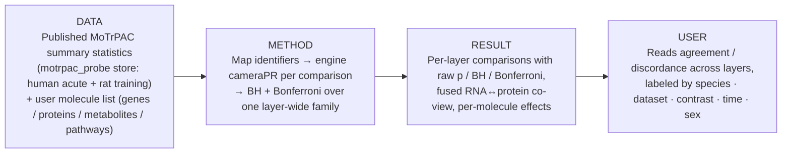
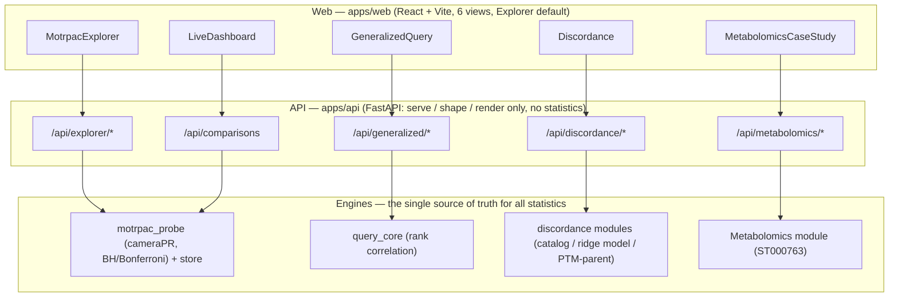

# Stanford Multi-omics Hackathon 2026 — Track 2

## Omic Discordance Explained

**MoTrPAC Explorer** — paste or upload any list of genes, proteins, metabolites, or
pathways and see every matching MoTrPAC exercise result across omic layers, species,
tissues, contrasts, timepoints, and sexes — with honest multiple-testing correction and
a traceable path from each shown value back to the published summary statistic behind it.

The Explorer is the project's headline: it turns the Track 2 question — *omic layers are
often discordant; can that discordance be modeled or explained?* — into a working
**paper → demo** trace. A molecule set from a paper goes in; every compatible MoTrPAC
comparison of that set comes back, layer by layer, so a user can read where RNA and
protein agree, where they diverge, and how strong the evidence is.

> [!IMPORTANT]
> Results are **cross-cohort association findings, not a claim of PAH treatment efficacy**.
> Cohorts are **analyzed separately and never merged** (muscle protein, plasma
> metabolomics, and blood stay distinct). The **PTM occupancy caveat applies to all
> reported findings**: PTM signal is not automatically a measure of modification
> occupancy, enzyme activity, or functional consequence.

---

## 1. Project snapshot

- **Title:** MoTrPAC Explorer (Exercise Signature Explorer) — Track 2, *Omic Discordance Explained*.
- **One-sentence purpose:** This project helps **exercise-biology researchers** **look up
  and compare any molecule set across MoTrPAC's omic layers** using the **published
  MoTrPAC summary statistics** so they can **see where layers agree or disagree and judge
  how much the data actually supports it**.
- **Intended users:** researchers and analysts working with MoTrPAC multi-omics who want
  to test a paper-derived signature against exercise data without re-running a pipeline.
- **Why it matters:** discordance between RNA, protein, and PTM is common and easy to
  over-interpret. A single honest lookup — with raw p, BH, and Bonferroni side by side,
  and every value labeled by species/dataset/contrast — keeps the interpretation grounded.
- **Main defensible result:** the directed male-rat SKM-GN muscle-protein signature scores
  **q = 0.0584 over the frozen 52-column BH family and is *not significant*** — reported
  honestly rather than upgraded. Alongside it, the discordance catalog classifies per-feature
  events and its out-of-fold ridge model of discordance is a **near-zero-R² weak prediction —
  a result, not a success claim**. See [Validation & limitations](#7-validation--limitations).

The app ships **six views**, with the **Explorer as the default** on load: Explorer, Live
results (API), Discordance, Generalized query, Metabolomics (ST000763), and About/Methods.

---

## 2. Research question

- **Question / objective.** Omic layers in MoTrPAC are often discordant. Can we let a user
  bring any molecule set and *see and interpret* that discordance against exercise data —
  and, where feasible, catalog and model when layers agree vs. disagree within a tissue?
- **Scope.** Compatible MoTrPAC transcriptomic, proteomic, phospho, and metabolomic
  summary statistics (human acute exercise + rat endurance training), plus a within-tissue
  RNA↔protein discordance catalog and a small predictive model over the committed demo.
- **Success criteria for this prototype.** A reproducible paper → demo path where (a) a
  real molecule list returns real, labeled MoTrPAC results across layers; (b) multiplicity
  is handled honestly and never narrowed to inflate significance; (c) every shown value
  traces back to a source statistic; and (d) a fresh clone reproduces the headline numbers.
  This is a **useful prototype / analysis path, not a production product** — the goal per
  the recommended MoTrPAC workflow is one reproducible result before stretch goals.

---

## 3. Workflow

**Data → Method → Result → User.** A user submits one or more molecule lists (paste,
upload, or a cited example). The API maps identifiers, runs the engine's cameraPR test for
the whole set against *every* included MoTrPAC comparison of a layer, applies BH and
Bonferroni across that one family, and returns per-layer results. The UI renders each
layer's comparisons with raw p / BH / Bonferroni and a fused RNA↔protein co-view.

The full seven-stage trace of the Explorer (and every other analysis path) lives in
[WORKFLOWS.md](WORKFLOWS.md), which also carries the API request→response contract and the
point→evidence→source chain used to keep results interpretable.

---

## 4. Setup & quick start

- **Prerequisites.** Python (engine + API install editable via `pip`), Node 22 for the web
  app (pinned in `apps/web/.mise.toml`), and **pnpm** as the single web package manager.
  R is needed only for the optional pathways table.
- **One-command bootstrap (fresh clone).** See **[BOOTSTRAP.md](BOOTSTRAP.md)** — it runs
  `bash scripts/bootstrap.sh`, which editable-installs the engine and API, fetches the
  mprobe store, and runs a smoke check within 600 seconds.
- **Run locally (two processes).** See **[RUN_LOCAL.md](RUN_LOCAL.md)** for the exact
  commands and port wiring (FastAPI API + Vite web). You open the **web** URL, not the API.
- **Reproduce one example run.** After the local app is up, open the **Explorer** (default
  view), pick a cited example (e.g. *Muscle protein set · 9 proteins*), and run it — every
  matching MoTrPAC comparison renders by layer. The exact commands and the software versions
  reproduced at each step are recorded in [VERIFICATION.md](VERIFICATION.md).

Setup steps are intentionally **not duplicated here** — BOOTSTRAP.md and RUN_LOCAL.md are
the authoritative, tested instructions.

---

## 5. Inputs & outputs

**Inputs.**
- **User lists** (one to six): genes/proteins (symbol, UniProt, Ensembl, rat symbol),
  metabolites (RefMet, HMDB, KEGG), or pathways (MSigDB / MitoCarta / RefMet-class set
  names). Optional `direction` (+1/−1) or numeric `score` column enables directional and
  rank-correlation views. Bare one-per-line lists are accepted.
- **Reference data:** the published MoTrPAC summary statistics in the `motrpac_probe`
  store (human acute exercise + rat 6-month endurance training). Required columns and the
  store layout are documented in [`hackathon/tool/store/SCHEMA.md`](hackathon/tool/store/SCHEMA.md).
- **Cited example inputs** (accessions/identifiers): Malenfant et al. 2015 muscle proteins,
  Mootha et al. 2003 OXPHOS genes (MSigDB), Cheadle et al. 2012 blood genes/pathways (PLoS
  ONE), GEO **GSE33463** ranked blood list, and Metabolomics Workbench **ST000763** plasma
  metabolites. Each example carries its source citation in the UI.

**Outputs.**
- Per-layer comparison tables (raw p, BH, Bonferroni), per-molecule effects, a fused
  RNA↔protein co-view, and CSV exports carrying species · dataset · contrast on every row.
- The directed path additionally returns a full `AnalysisResponse` (run_id, columns,
  features, multiplicity family, provenance) and a downloadable evidence bundle.
- The discordance demo outputs (`catalog.csv`, `model_metrics.csv`, `model_predictions.csv`,
  `run_summary.json`) plus the PTM-parent audit live under
  `MoTrPAC Hackathon/generalized/discordance/`.

What each field means, and the exact request→response contract for every endpoint, is in
[WORKFLOWS.md](WORKFLOWS.md).

---

## 6. Methods & provenance

- **Analysis approach.** All statistics originate in the engines — `motrpac_probe`
  (directed signature + the Explorer's cameraPR), `query_core` (generalized rank
  correlation), the standalone Metabolomics module (ST000763), and the standalone
  discordance modules (catalog / ridge model / PTM-parent audit). The FastAPI and React
  layers only **serve, shape, and render**; they compute no statistics. The reasoning
  behind each choice is recorded as ADRs in [DECISIONS.md](DECISIONS.md).
- **Datasets & versions.** MoTrPAC human acute exercise (`MotrpacHumanPreSuspensionAnalysis`
  2.0.8) and rat endurance training (`MotrpacRatTraining6moData` 2.0.0), read from the
  published summary-statistics store. External datasets are cited below.
- **AI usage (disclosed for integrity).** This project was built with AI assistance across
  the whole effort — **Codex, Kiro, Claude, and ChatGPT** all contributed to prompting,
  planning, implementation, and documentation. The integrity boundary is strict: **AI
  assisted the development, but every reported number originates in the engines**, not in a
  language model. This is enforced mechanically by the golden-hash guard on the frozen
  scientific core (`hackathon/tool/analysis.py`) and by the reproducible test battery
  recorded in [VERIFICATION.md](VERIFICATION.md). No result sentence is filled in by an AI;
  each is computed from stored statistics.
- **Citations.**
  - MoTrPAC Study Group. MoTrPAC published summary statistics (human PreSuspension analysis
    2.0.8; rat 6-month training data 2.0.0).
  - Malenfant S. et al. (2015). Skeletal muscle proteomic signature in pulmonary arterial
    hypertension. *Journal of Molecular Medicine*.
  - Mootha V.K. et al. (2003). PGC-1α-responsive genes involved in oxidative phosphorylation
    are coordinately downregulated in human diabetes. *Nature Genetics* (MSigDB MOOTHA_VOXPHOS).
  - Cheadle C. et al. (2012). Erythroid-specific transcriptional changes in PAH. *PLoS ONE*.
  - GEO **GSE33463** (blood expression, re-analyzed with limma).
  - Metabolomics Workbench **ST000763** (SSc-PAH plasma metabolomics).
- **External code & licenses.** Engine, API, and web dependencies retain their upstream
  licenses (see `hackathon/tool/src/motrpac_probe/vendor/LICENSES.md`). This repository is
  released under the MIT License — see [LICENSE](LICENSE).

A deeper methods discussion for the metabolomics case study is in
[METABOLOMICS.md](METABOLOMICS.md).

---

## 7. Validation & limitations

**Reproducible test subset.** The committed demo doubles as the validation subset. A fresh
clone reproduces the headline values, and the exact commands/counts/hashes are logged per
gate in [VERIFICATION.md](VERIFICATION.md):

- Directed headline: **q = 0.0584**, labeled **not significant**, over the frozen 52-column
  BH family. The 16-column `q = 0.0413` appears only as a labeled sensitivity analysis.
- Discordance per-class counts: `supported_concordant` = 1, `supported_opposite` = 0,
  `rna_response_protein_equivalent` = 285, `indeterminate` = 5642.
- Metabolomics null result: blood exercise-sensitive `hits_fraction = 0.0`, Fisher `p = 0.609`.
- Battery: engine **123 passed / 34 skipped**, `apps/api` **81 passed**, web **38 passed**
  + build OK, golden-hash on `analysis.py` **OK**.

**Screenshots / plots.** <!-- SCREENSHOT PLACEHOLDER: insert Explorer + Discordance demo
screenshots here (user-provided). Reference committed figures such as
MoTrPAC Hackathon/generalized/discordance/demo_muscle_ee/discordance_overview.png if useful. -->
_Figures to be inserted by the team._

**Known failure modes / fragile spots.**
- The Explorer's *Pathways* input needs the R-built table
  `apps/api/data/motrpac_camera_pathways.csv.gz` (`Rscript apps/api/scripts_build_pathways.R`).
  It is gitignored (~32 MB); without it, gene/protein and metabolite lists still work and
  the Pathways tab explains how to build it.
- Live recompute of the discordance catalog from an arbitrary tissue/contrast/timepoint is
  **out of scope**; the app serves committed demo outputs read-only.
- Identifiers that don't map to the store are reported as unmapped rather than silently dropped.

**What the results do and do not establish.** They establish *associations* between a
molecule set and MoTrPAC exercise responses, honestly corrected. They do **not** establish
treatment efficacy, causal direction, or PTM occupancy/enzyme activity. Cohorts are never
merged.

---

## 8. Reuse & continuation

- **Repository layout.**
  - `apps/api/` — FastAPI service wrapping the engine + read-only adapters (Explorer,
    discordance, metabolomics, generalized).
  - `apps/web/` — React (Vite) frontend; six views, Explorer default.
  - `hackathon/tool/` — the `motrpac_probe` engine (scientific source of truth) + its store.
  - `MoTrPAC Hackathon/` — analysis modules (rat comparison, transcriptomics, metabolomics,
    the generalized `query_core` backend, and the discordance catalog / PTM-parent audit).
  - Root docs: WORKFLOWS, DECISIONS, VERIFICATION, METABOLOMICS, RUN_LOCAL, BOOTSTRAP,
    MERGE_PLAN, JUDGING_CRITERIA, HANDOFF_NEXT_FEATURES.
- **Contributors & roles.** Jimmy Zhen, Nur-Taz Rahman, Sheng-Ya Wu, and additional
  contributors (`dani`, `StanchPillow55`) across engineering, scientific analysis, and
  documentation. _Specific per-person role assignments to be confirmed by the team before
  submission._
- **License & citation.** MIT — see [LICENSE](LICENSE) (© 2026 Stanford Bioinformatics
  Center). Cite the MoTrPAC data releases and the external datasets listed in
  [Methods & provenance](#6-methods--provenance).
- **Next steps (separated from completed work).** Carried forward in
  [HANDOFF_NEXT_FEATURES.md](HANDOFF_NEXT_FEATURES.md): live discordance recompute, Option-2
  engine live metabolite scoring, and epigenomics layers. The **first thing a future
  contributor should try** is a fresh-clone bootstrap (BOOTSTRAP.md) followed by an Explorer
  example run, then reading the Explorer trace in WORKFLOWS.md.

---

## Documentation map

- [WORKFLOWS.md](WORKFLOWS.md) — every analysis workflow (incl. the Explorer) traced through
  seven stages, with the API request→response contract and the point→evidence→source chain.
- [DECISIONS.md](DECISIONS.md) — architecture decision records explaining each choice and trade-off.
- [VERIFICATION.md](VERIFICATION.md) — the clean-clone reproduction log with exact commands, counts, and hashes per gate.
- [JUDGING_CRITERIA.md](JUDGING_CRITERIA.md) — how the project maps to the Track 2 judging criteria, with a submission checklist.
- [METABOLOMICS.md](METABOLOMICS.md) — the metabolomics case-study module, its relationship to the engine, and the convergence cross-check.
- [RUN_LOCAL.md](RUN_LOCAL.md) — how to run the API and web app locally, including the exact ports.
- [BOOTSTRAP.md](BOOTSTRAP.md) — the one-command fresh-clone bootstrap and the `parents[3]` path-coupling constraint.

---

## System design

**Interpretability & traceability.** Every rendered value resolves, as an ordered sequence,
to an evidence record and then to a source-of-truth origin (point → evidence → source). That
chain is asserted at the API level by `test_point_to_evidence_to_source_chain` and its
browser-level Playwright counterpart. The full trace, per analysis path, is in
[WORKFLOWS.md](WORKFLOWS.md).
