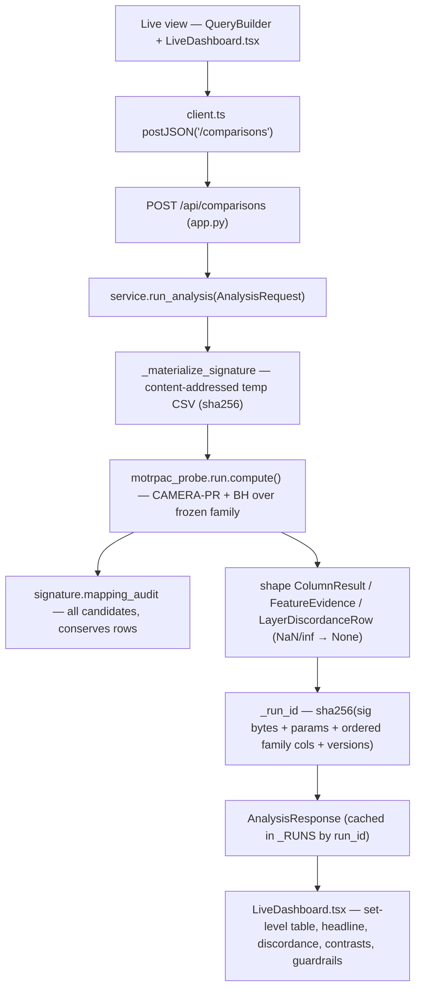
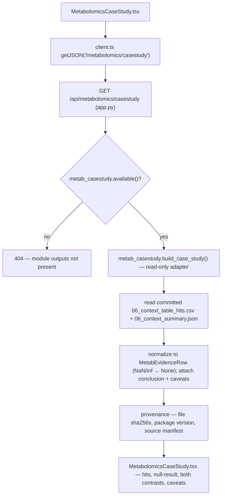
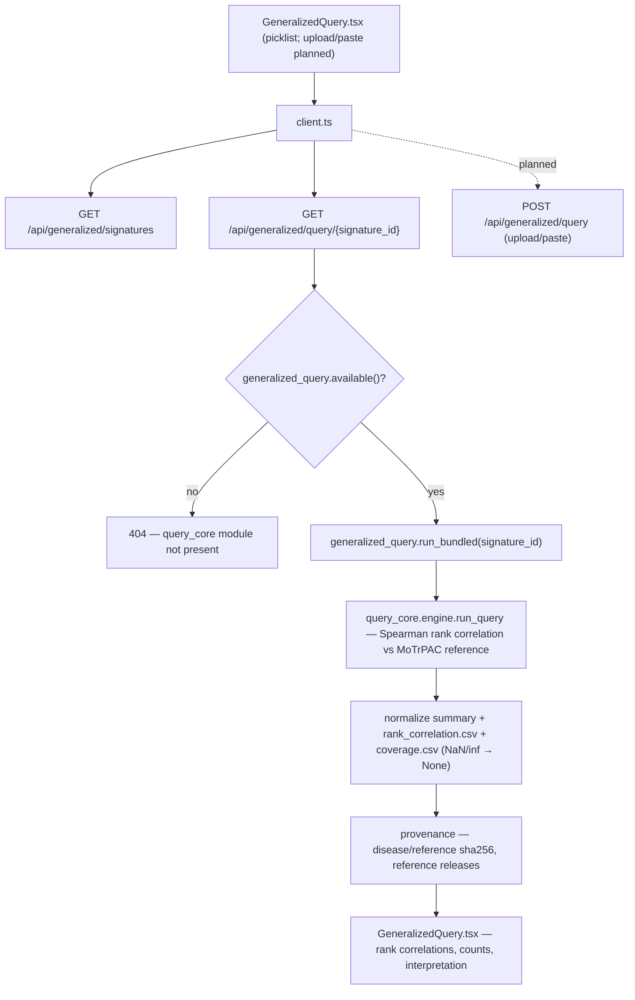
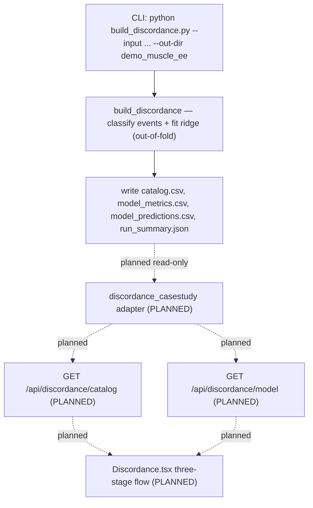
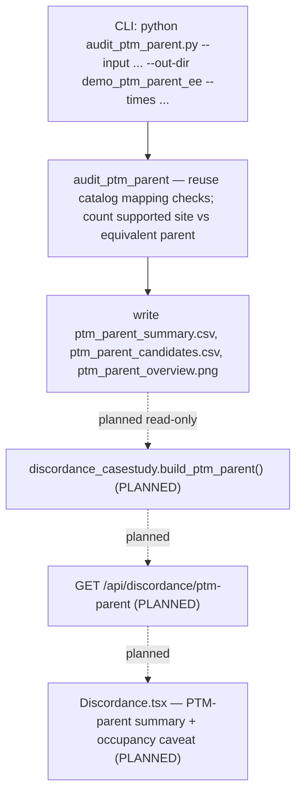

# WORKFLOWS — every analysis path traced end to end

Purpose: a single map of every analysis workflow in this repository so a contributor
understands what each path does *before* analyzing success criteria or building features
(Requirement 1, documentation-first).

This document is **documentation only**. It adds, removes, and alters **no runtime source
file**. Everything below was traced by reading the actual code (`apps/api/motrpac_probe_service/*`,
`apps/web/src/*`, and `MoTrPAC Hackathon/generalized/discordance/*`) and the committed demo
outputs; nothing here is invented.

## Source-of-truth boundary (applies to every workflow)

All statistics originate in the engines — `motrpac_probe` (directed path), `query_core`
(generalized path), the standalone Metabolomics module (ST000763 case study), and the standalone
discordance modules (catalog / predictive model / PTM-parent audit). The FastAPI layer
(`apps/api`) and the React client (`apps/web`) only **serve**, **shape** (JSON-safe), and
**render**. They compute no statistics. Read-only adapters follow the *Option-1 adapter pattern*:
resolve the repo root as `Path(__file__).resolve().parents[3]`, guard availability with an
`available()` check, read committed CSV/JSON, coerce `NaN`/`Infinity` → `null`, and return a
JSON-safe dataclass.

## The five analysis types

1. **directed_signature** — `run_analysis`, `motrpac_probe` engine (API + UI, live).
2. **metabolomics_case_study** — `metab_casestudy` Option-1 adapter over the ST000763 module (API + UI, read-only).
3. **generalized_query** — `generalized_query` adapter over `query_core` (API + UI; upload endpoint planned).
4. **discordance catalog + predictive model** — standalone discordance module (**CLI-only today**; read-only API + Discordance view planned).
5. **PTM-parent audit** — `audit_ptm_parent.py` (**CLI-only today**; read-only API + Discordance view planned).

Each type below is traced through the **seven stages in order**: entry point → module/function →
data read → transform → output fields → provenance/run_id → UI view. Any stage that does not exist
for a type is stated as **not applicable** rather than omitted.

---

## 1. directed_signature

Score a signed disease signature against the MoTrPAC exercise comparison family. This is the only
path that computes new statistics at request time (inside the `motrpac_probe` engine, never in the
API/UI layer).

1. **Entry point.** UI: `apps/web/src/components/QueryBuilder.tsx` + `LiveDashboard.tsx` call the
   typed client `apps/web/src/api/client.ts`. API: `POST /api/comparisons` in
   `apps/api/motrpac_probe_service/app.py` (`post_comparisons`). Related read-back endpoints:
   `GET /api/comparisons/{run_id}`, `.../features`, `.../provenance`, `.../report`, `.../export`;
   plus `POST /api/signatures/validate` and `POST /api/mappings/preview` for the mapping-preview gate.
2. **Module / function.** `motrpac_probe_service/service.py::run_analysis` wraps
   `motrpac_probe.run.compute()`. Mapping audit via `motrpac_probe.signature.mapping_audit`; verdicts
   via `motrpac_probe.run.verdict`; caveats/guardrails via `motrpac_probe.caveats`.
3. **Data read.** The signature comes from exactly one source: a built-in example CSV under
   `motrpac_probe.paths.EXAMPLES` (e.g. `pah_muscle_malenfant2015.csv`), pasted `signature_csv_text`,
   or `signature_rows` materialized to a content-addressed temp CSV. The MoTrPAC comparison family is
   read from the engine's parquet store (`motrpac_probe.store` / `core.get_store()`).
4. **Transform.** The engine runs CAMERA-PR per comparison column, applies **BH across the frozen
   family** (52 core columns; `family_size` reported from `core_cols`, never hardcoded), and computes
   per-feature effects. `run_analysis` extracts only JSON-safe scalars (`_clean`: `NaN`/`inf` →
   `None`) and derives per-gene collapse lineage (`aggregation_method = "max_abs_stat"` when >1 assay
   feature maps to a gene). BH is **never re-run** when the UI filters for display.
5. **Output fields.** `AnalysisResponse`:
   `run_id`, `schema_version`, `status` (`ok` | `no_compatible_data` | `no_mapped_features`),
   `message`, `signature_name`, `n_input_rows`, `n_counted_genes`, `n_mapped_rows`, `returned_layers`,
   `contrasts`, `mapping_audit[]`, `columns[]` (`ColumnResult`: `column_id`, `comparison_label`,
   `dataset`, `species`, `tissue`, `layer`, `sex`, `timepoint`, `n_measured`, `n_opposed`, `n_same`,
   `camera_t`, `camera_p`, `camera_fdr`, `verdict`, `significant`), `features[]` (`FeatureEvidence`:
   `evidence_id`, `gene`, `disease_direction`, `column_id`, effect fields, `mapping_decision_id`,
   `source_feature_id`, `n_collapsed`, `aggregation_method`), `layer_discordance[]`
   (`LayerDiscordanceRow`), `multiplicity_family` (`MultiplicityFamily`: method `BH`, `threshold`,
   `family_size`, `n_tests`, ordered `column_ids`), `headline`, `caveats[]`, `guardrails[]`,
   `provenance`.
6. **Provenance / run_id.** `service._run_id` = `sha256(signature bytes + analysis params
   {target_species, selected_omics, fdr_threshold} + ordered family column IDs + mapping version +
   store hash + code version + seed + schema version)[:24]`. Presentation-only fields
   (`include_nonsignificant`, display tissue/sex/timepoint) are **excluded**; `fdr_threshold` is
   **included**. `run.provenance()` records the multiplicity family, `run_id`, and `schema_version`.
   Responses are cached in-process in `app.py::_RUNS` keyed by `run_id`.
7. **UI view.** `apps/web/src/components/LiveDashboard.tsx` (nav entry "Live"): set-level results
   table, the frozen headline (male rat SKM-GN protein, 8 wk, `q = 0.0584`, labeled not significant),
   both contrasts, guardrails, PTM caveat, and export/report links.

---

## 2. metabolomics_case_study

A separate, read-only descriptive case study of the ST000763 SSc-PAH plasma cohort in MoTrPAC
context. A distinct cohort from the Malenfant muscle signature and the rat exercise data — never
blended. No statistics and no R at request time.

1. **Entry point.** UI: `apps/web/src/components/MetabolomicsCaseStudy.tsx`. API:
   `GET /api/metabolomics/casestudy` (and `.../casestudy/export`, `.../convergence`) in `app.py`.
2. **Module / function.** `motrpac_probe_service/metab_casestudy.py::build_case_study` (Option-1
   adapter; `available()` guard). `convergence.py::cross_check` reconciles the module's MoTrPAC export
   against the engine METAB store on shared EE-CON cells.
3. **Data read.** Committed outputs of the standalone module:
   `MoTrPAC Hackathon/Metabolomics/output/06_context_table_hits.csv` and `06_context_summary.json`,
   plus `data/source_manifest.json`. Resolved via `_REPO = Path(__file__).resolve().parents[3]`.
4. **Transform.** Read committed rows/summary and coerce every value to a JSON-safe scalar (`_num`:
   `NaN`/`inf`/unparseable → `None`). No statistic is computed; counts and labels are served as
   present in the files.
5. **Output fields.** `MetabCaseStudyResponse`: `run_id`, `schema_version`, `analysis_type`,
   `case_study_id`, `cohort_label`, `title`, `n_hits`, `n_hits_matched_blood`,
   `n_background_matched_blood`, `hit_labels`, `null_result`,
   `median_pah_effect_over_control_drift`, `contrasts` (disease + MoTrPAC EE-CON/EE-EE/CON-CON with
   the EE-EE caveat), `conclusion`, `caveats[]`, `hits[]` (`MetabEvidenceRow`), `provenance`.
6. **Provenance / run_id.** `run_id = sha256(hits+summary bytes + package version + schema
   version)[:24]`. `provenance` records the source-of-truth note (Option-1 adapter), the MoTrPAC
   package version, the label rule, per-file sha256 (`_sha16`), and the source-dataset manifest.
7. **UI view.** `MetabolomicsCaseStudy.tsx` (nav entry "Metabolomics"): a separate top-level view;
   hits, the null acute-response result, both contrasts, the setting/scleroderma conclusion, and the
   separate-cohort + PTM caveat rendered verbatim.

---

## 3. generalized_query

Run any normalized disease-signature CSV against MoTrPAC contrast summaries through the `query_core`
engine. Bundled example signatures reproduce the legacy hardcoded results. `query_core` is the
source of truth; the adapter runs it in-process into a temp dir and normalizes the outputs.

1. **Entry point.** UI: `apps/web/src/components/GeneralizedQuery.tsx`. API:
   `GET /api/generalized/signatures` (picklist) and `GET /api/generalized/query/{signature_id}` in
   `app.py`. **Planned:** `POST /api/generalized/query` for uploaded/pasted signatures (Requirement 5).
2. **Module / function.** `motrpac_probe_service/generalized_query.py`: `available()`,
   `list_signatures()`, `run_bundled(signature_id)`; imports `query_core.engine.run_query` in-process
   by adding `MoTrPAC Hackathon/generalized` to `sys.path`. **Planned:** `run_uploaded(...)` mirroring
   `run_bundled` with `query_core`-schema validation and a content-addressed temp file.
3. **Data read.** Bundled signature CSVs under
   `MoTrPAC Hackathon/generalized/examples/signatures/*.csv.gz` and the reference
   `query_core/motrpac_reference.csv.gz` (or `_full`). The engine writes `rank_correlation.csv` and
   `coverage.csv` into a temp dir the adapter reads back.
4. **Transform.** `query_core` computes Spearman rank correlations between the signature and each
   MoTrPAC reference contrast column. The adapter normalizes the engine's summary + rank rows +
   coverage count and cleans numerics (`_clean`: `NaN`/`inf` → `None`). No statistic computed in the
   adapter.
5. **Output fields.** dict: `analysis_type` (`generalized_query`), `schema_version`, `signature_id`,
   `signature_label`, `tissue`, `reference`, `counts`, `filters`, `thresholds`, `interpretation`,
   `rank_correlation[]` (`layer`, `timepoint`, `contrast_category`, `n_used`, `spearman_rho`,
   `status`), `coverage_rows`, `provenance`.
6. **Provenance / run_id.** **No `run_id`** for the bundled read path — **not applicable**; provenance
   instead carries the engine name (source of truth), the disease/reference input paths and their
   sha256, and the reference release versions returned by the engine. (The planned upload endpoint
   writes a content-addressed temp file keyed by the signature sha256.)
7. **UI view.** `GeneralizedQuery.tsx` (nav entry "Generalized"): bundled-signature picklist, the
   reproduced rank correlations, counts, and the engine interpretation. Upload/paste controls are
   planned.

---

## 4. discordance catalog + predictive model  **(CLI-only today)**

A descriptive within-tissue RNA–total-protein event catalog plus a small out-of-fold ridge
predictive model over MoTrPAC human summary-level exercise effects. This path is **CLI-only** in the
repository today: it is run from the command line and its committed demo outputs live under
`demo_muscle_ee/`. A read-only API adapter (`discordance_casestudy.py`) and the Discordance view are
**planned** (Requirements 2 and 3); the endpoints below are planned, GET-only, and serve committed
demo outputs (live recompute is a documented follow-on, out of scope for this MVP).

1. **Entry point.** **CLI:** `python MoTrPAC Hackathon/generalized/discordance/build_discordance.py
   --input <effects.csv.gz> --out-dir <dir> --tissue muscle --contrast-category EE-CON --target-time
   post_24_hr --earlier-times post_15_30_45_min post_3.5_4_hr`. **Planned API:**
   `GET /api/discordance/catalog` and `GET /api/discordance/model` (GET-only; 404 when the guard
   reports unavailable).
2. **Module / function.** `build_discordance.py` (`read_effects`, `filter_and_audit`,
   `representative_features`, classification, ridge fit via scikit-learn). **Planned adapter:**
   `discordance_casestudy.build_catalog_summary()` / `build_model()` guarded by `catalog_available()`
   / `model_available()`.
3. **Data read.** Input is a long table of MoTrPAC human **summary-level effects** (an
   `export_motrpac_human.R` export or a compatible query-core reference CSV). Committed demo outputs:
   `demo_muscle_ee/{catalog.csv, model_metrics.csv, model_predictions.csv, run_summary.json}`.
4. **Transform.** Per gene/UniProt, select one representative RNA and one protein feature by time
   coverage then abundance (never by response strength); classify each event; fit a zero-change
   baseline, a contemporaneous RNA-only ridge, and a temporal ridge (adds earlier RNA and early
   site-minus-parent PTM), evaluated **out-of-fold** with all rows for a gene in the same fold, ridge
   penalty fixed at 10, no tuning on held-out responses. Descriptive classes are not joint-FDR claims.
5. **Output fields.**
   - `catalog.csv` — one target-time entry per protein gene/UniProt with `event_class`. The committed
     `event_class` domain is six labels: four **classification classes**
     (`supported_concordant`, `supported_opposite`, `rna_response_protein_equivalent`,
     `indeterminate`) and two **coverage states** (`no_protein_measurement`, `no_rna_measurement`).
     Committed counts (`run_summary.json.catalog_classes`): `supported_concordant` = 1,
     `supported_opposite` = 0 (absent in this demo), `rna_response_protein_equivalent` = 285,
     `indeterminate` = 5642, `no_protein_measurement` = 9228, `no_rna_measurement` = 255.
   - `model_metrics.csv` — **exactly 6 rows** = {`all_mapped`, `rna_responsive`} × {`zero`,
     `rna_only`, `temporal`}; columns `subset, model, n_rows, n_genes, mae, rmse, r2`. Out-of-fold
     R² values are near zero (a weak prediction — a result, not a success claim).
   - `model_predictions.csv` — out-of-fold predictions with observed `RNA − protein` and the algebraic
     residual.
   - `run_summary.json` — `tissue`, `contrast_category`, `target_time`, `earlier_times`, `alpha`,
     `min_effect`, `equivalence_margin`, `catalog_classes`, `mapping_audit`, `model` block
     (`eligible_rows/genes`, `temporal_features`, `model_status`), and `limitations`.
6. **Provenance / run_id.** **No service `run_id`** — **not applicable** for the CLI path;
   provenance is `run_summary.json` (settings, mapping-exclusion counts,
   `source_package_versions` e.g. `2.0.8`, and interpretation `limitations`). The planned adapter
   attaches per-file sha256 provenance in the Option-1 style.
7. **UI view.** **Not applicable today (CLI-only).** Static overview image `discordance_overview.png`
   exists in the demo dir. **Planned:** the three-stage Discordance view (`Discordance.tsx`) renders
   the four classification-class counts (including zero), the six model-metrics rows with a visible
   weak-prediction statement, coverage states as context, and an error/empty state that hides all
   counts/metrics on failure.

---

## 5. PTM-parent audit  **(CLI-only today)**

A descriptive summary-level audit counting phosphosite changes whose mapped parent protein is
equivalently small — a separate, potentially better-populated Track 2 question. **CLI-only** in the
repository today, with committed demo outputs under `demo_ptm_parent_ee/`. A read-only API adapter
(`build_ptm_parent()`) and Discordance-view rendering are **planned** (Requirements 2 and 3). The
site-minus-parent difference is **descriptive**, not measured phosphorylation occupancy.

1. **Entry point.** **CLI:** `python MoTrPAC Hackathon/generalized/discordance/audit_ptm_parent.py
   --input <effects.csv.gz> --out-dir <dir> --tissue muscle --contrast-category EE-CON --times
   post_15_30_45_min post_3.5_4_hr post_24_hr`. **Planned API:** `GET /api/discordance/ptm-parent`
   (GET-only; 404 when unavailable).
2. **Module / function.** `audit_ptm_parent.py::main` (reuses `build_discordance.read_effects`,
   `filter_and_audit`, `representative_features`). **Planned adapter:**
   `discordance_casestudy.build_ptm_parent()` guarded by `ptm_available()`.
3. **Data read.** Same MoTrPAC human summary-level effects input as the catalog path. Committed demo
   outputs: `demo_ptm_parent_ee/{ptm_parent_summary.csv, ptm_parent_candidates.csv,
   ptm_parent_overview.png}`.
4. **Transform.** Reuse the catalog's mapping exclusions and contrast checks; select representative
   protein features; per timepoint count supported phosphosite rows (BH q ≤ 0.05, |log2 FC| ≥ 0.2,
   sign-consistent CI excluding zero) and equivalently small parents (CI wholly inside ±0.2), and
   their intersection. No occupancy or kinase-activity is estimated.
5. **Output fields.**
   - `ptm_parent_summary.csv` — one row per timepoint; columns `tissue, contrast_category, timepoint,
     raw_phosphosite_rows, after_mapping_checks_with_uniprot,
     excluded_missing_or_ambiguous_site_mapping,
     matched_to_single_gene_uniprot_single_feature_parent, matched_with_both_site_and_parent_ci,
     supported_phosphosite_rows_among_matched, parent_equivalent_rows_among_matched,
     supported_phosphosite_and_parent_equivalent_rows, candidate_genes`. Committed:
     `post_15_30_45_min` → 735 supported-and-equivalent rows / 350 candidate genes; `post_3.5_4_hr` →
     13 / 8; `post_24_hr` → 1 / 1.
   - `ptm_parent_candidates.csv` — the intersection rows (749 data rows in the committed demo).
6. **Provenance / run_id.** **No service `run_id`** — **not applicable** for the CLI path; the
   denominators and mapping exclusions in `ptm_parent_summary.csv` (and the shared catalog
   `run_summary.json`) are the provenance. The planned adapter attaches per-file sha256 provenance.
7. **UI view.** **Not applicable today (CLI-only).** Static overview image `ptm_parent_overview.png`.
   **Planned:** the Discordance view renders the PTM-parent divergence summary and the PTM occupancy
   caveat as visible text.

---

## API endpoint request → response contract

Existing endpoints are traced from `apps/api/motrpac_probe_service/app.py`. Planned endpoints
(Requirements 2 and 5) are marked **PLANNED** and are GET-only for discordance; the generalized
upload endpoint is a POST. Scientific empty states return HTTP 200; malformed input returns 4xx;
a missing committed demo output returns 404 via the `available()` guard.

| Method + path | Request inputs | Response outputs | Triggering condition |
| --- | --- | --- | --- |
| `GET /api/health` | none | `status`, `schema_version`, `store_hash` | health/liveness probe |
| `GET /api/catalog` | none | `contexts[]`, `capability_matrix`, supported/unsupported source species, `store_hash`, `analysis_types` | UI needs catalog + selector values |
| `POST /api/availability` | `target_species`, `selected_omics[]`, `tissue?`, `sex?`, `timepoint?` | `status`, `resolved_context`, `available_omics[]`, `unavailable_omics[]`, `message`, `suggested_alternatives[]` (empty state = 200) | resolve whether a request has compatible data |
| `POST /api/signatures/validate` | one of `signature_rows` / `signature_csv_text` / `example_name` | `counts`, `rows[]` (mapping audit) | validate a signature before running |
| `POST /api/mappings/preview` | one of `signature_rows` / `signature_csv_text` / `example_name` | `counts`, `rows[]`, `requires_confirmation` | mandatory mapping-preview gate before a comparison |
| `POST /api/comparisons` | `AnalysisRequestIn` (exactly one signature source; `target_species`, `selected_omics[]`, `tissue?`, `sex?`, `timepoint?`, `fdr_threshold` `0<t<1`, `include_nonsignificant`) | full `AnalysisResponse` (incl. `run_id`, `status`) | run the directed analysis |
| `GET /api/comparisons/{run_id}` | `run_id` path param | cached `AnalysisResponse` | read back a cached run (404 if unknown) |
| `GET /api/comparisons/{run_id}/features` | `run_id` | `{run_id, features[]}` | per-feature evidence rows |
| `GET /api/comparisons/{run_id}/provenance` | `run_id` | provenance dict (family, run_id, versions) | provenance for a run |
| `GET /api/comparisons/{run_id}/report` | `run_id` | HTML report | human-readable report |
| `GET /api/comparisons/{run_id}/export` | `run_id` | ZIP evidence bundle | download reproducible bundle |
| `GET /api/metabolomics/casestudy` | none | `MetabCaseStudyResponse` | render the ST000763 case study (404 if `not available()`) |
| `GET /api/metabolomics/casestudy/export` | none | ZIP (summary/hits/conclusion/provenance) | download the case study (404 if unavailable) |
| `GET /api/metabolomics/convergence` | none | cross-check payload | module-vs-engine integrity check (404 if unavailable) |
| `GET /api/generalized/signatures` | none | `{signatures[], note}` | bundled-signature picklist (404 if `not available()`) |
| `GET /api/generalized/query/{signature_id}` | `signature_id` | normalized `run_bundled` payload (rank correlations + provenance) | run a bundled signature (404 if unknown/unavailable) |
| **PLANNED** `POST /api/generalized/query` | `{signature_csv_text, tissue, reference_contrast_category, reference}` | normalized `run_bundled`-shaped payload; **422** naming the unmet `query_core` schema requirement on non-conforming input | run an uploaded/pasted generalized signature |
| **PLANNED** `GET /api/discordance/catalog` | none | classification-class counts + coverage-state counts + run settings + provenance | render the discordance catalog (404 if `not catalog_available()`, incl. event-class domain gate) |
| **PLANNED** `GET /api/discordance/model` | none | 6 metric rows + model block + limitations + weak-prediction note | render the predictive model (404 if `not model_available()`) |
| **PLANNED** `GET /api/discordance/ptm-parent` | none | PTM-parent summary rows + candidate count + occupancy caveat | render the PTM-parent audit (404 if `not ptm_available()`) |

---

## Point → evidence → source chain

Every rendered data point in the UI resolves, as an **ordered sequence**, to an evidence record and
then to a source-of-truth origin:

1. **Point.** A rendered value in the UI — a set-level row (`ColumnResult` in the Live results
   table) or a per-feature row (`FeatureEvidence`) — identified by its `column_id`.
2. **Evidence.** Each feature carries a run-scoped `evidence_id` (`{run_id}:{column_id}:{gene}`) and
   a `mapping_decision_id` (`{run_id}:map:{gene}`), exported in the run's features/provenance and in
   the evidence bundle. `n_collapsed` and `aggregation_method` record how many assay features were
   collapsed into the gene and by what rule (`max_abs_stat` when >1).
3. **Source.** For a measured feature, `source_feature_id` is the store `feature_id` backing that
   gene in that column — a real record in the `motrpac_probe` store (`S.frame(column_id)`). The
   provenance also carries the ordered multiplicity-family column IDs, store hash, mapping version,
   code version, seed, and schema version, so the value traces back to the engine that produced it.

This chain is asserted at the API level by **`test_point_to_evidence_to_source_chain`** (in
`apps/api/tests/test_api.py`): for a real run, every measured feature traces point → shown column,
carries a run-scoped `evidence_id`, and has a `source_feature_id` that exists in that column's store
rows. Its planned browser-level counterpart (Requirement 9) selects a data point and verifies the
linked evidence and source are displayed.
